# IdiomTranslate30 — Basic Statistics Report

*Generated on 2026-03-22*

> **Disclaimer:** This report was automatically generated by [Claude Code](https://claude.ai/claude-code).
> Numerical results are derived from scripts run against the raw data, but interpretations,
> summaries, and prose descriptions may contain errors or hallucinations. Verify critical
> findings against the source scripts and data before citing.

---

## Overview

**IdiomTranslate30** is a massively multilingual dataset of context-aware translations of East Asian
idioms across 30 language pairs, generated using Google Gemini 3.0 Flash Preview. It extends the
translation methodology introduced in *Tang et al. (2024), "Creative and Context-Aware Translation
of East Asian Idioms with GPT-4"* (Findings of EMNLP 2024, pp. 9285–9305), scaling from a single
language pair to 30 language pairs and switching the backbone model from GPT-4 to Gemini 3.0.

The name **IdiomTranslate30** is doubly meaningful: 30 language pairs (3 source × 10 target), and
30 parallel translations per (idiom, target language) — 10 context sentences each translated under
3 strategies (Creatively, Analogy, Author), giving 30 translations per cell.

Each row in the dataset corresponds to one (source idiom, target language, context sentence) triple
and contains **3 translations** (one per strategy) plus 3 span annotations, for a total of
**2,719,800 individual translations** (906,600 rows × 3 strategies).

The 906,600 rows are derived as follows:

| Source | Idioms | × Target langs | × Sentences | = Rows |
|---|---|---|---|---|
| Chinese | 4,306 | 10 | 10 (20 for 4 idioms) | 431,000 |
| Japanese | 2,440 | 10 | 10 | 244,000 |
| Korean | 2,316 | 10 | 10 | 231,600 |
| **Total** | **9,062** | | | **906,600** |

> **Unintentional dictionary duplicates — two types:**
>
> **(1) 113 ZH–JA shared idiom strings.** The per-source totals sum to **9,062**, but the
> dataset-wide unique count is **8,949** because 113 classical Chinese idiom strings (e.g.
> 一丘之貉, 一刻千金, 一字千金) appear identically as both a Chinese entry and a Japanese
> yojijukugo entry. These are unintentional duplicates caused by the same string being present
> in both the Chinese and Japanese source dictionaries. All 113 appear as "exact_4/4" pairs in
> the ZH–JA cognate table (see Extended Cognate Analysis below), accounting for 113 of the 266 reported exact matches;
> the remaining 153 are genuine cognates with different raw forms (e.g. simplified ZH 精明强干
> vs Japanese 精明強幹) that match only after s2t normalisation.
>
> **(2) 4 Chinese idioms entered twice in the source dictionary.** 前仆后继, 固执己见,
> 生龙活虎, and 触景生情 each triggered two independent sentence-generation prompt runs instead
> of one, producing 20 sentences per target language rather than 10. Inspection confirms the
> two runs are stored as consecutive blocks of 10: sentences 1–10 and 11–20 are generated
> independently from the same prompt, and do overlap — for 触景生情, sentences 11–13 are exact
> duplicates of sentences 1–3. This adds 4 × 10 × 10 = 400 extra rows, explaining why
> 4,306 × 10 × 10 = 430,600 ≠ 431,000.

| Property | Value |
|---|---|
| Total rows | 906,600 |
| Total translations | 2,719,800 (906,600 × 3 strategies) |
| Columns | 10 |
| Source languages | 3 (Chinese, Japanese, Korean) |
| Target languages | 10 |
| Language pairs | 30 (3 × 10) |
| Context sentences per (idiom, target language) | 10 |
| Translation strategies per sentence | 3 (Creatively, Analogy, Author) |
| Unique idioms | 8,949 |
| Missing span annotations | 62 |
| License | CC-BY-NC-SA-4.0 |

---

## Language Distribution

### Source Languages

| Language | Rows | Share |
|---|---|---|
| Chinese | 431,000 | 47.5% |
| Japanese | 244,000 | 26.9% |
| Korean | 231,600 | 25.5% |

### Target Languages

| Language | Rows | Share |
|---|---|---|
| Arabic | 90,660 | 10.0% |
| Bengali | 90,660 | 10.0% |
| English | 90,660 | 10.0% |
| French | 90,660 | 10.0% |
| German | 90,660 | 10.0% |
| Hindi | 90,660 | 10.0% |
| Italian | 90,660 | 10.0% |
| Russian | 90,660 | 10.0% |
| Spanish | 90,660 | 10.0% |
| Swahili | 90,660 | 10.0% |

Each of the 10 target languages is perfectly balanced (~90,660 rows, 10.0%).
Each of the 30 language pairs contains a fixed number of rows proportional to the source language's
idiom inventory size (Chinese: 43,100 / pair; Japanese: 24,400 / pair; Korean: 23,160 / pair).

---

## Idiom Coverage

| Source Language | Unique Idioms |
|---|---|
| Chinese | 4,306 |
| Japanese | 2,440 |
| Korean | 2,316 |
| **Total** | **8,949** |

Most idioms appear **100 times** in the dataset (10 target languages × 10 context sentences).
Four Chinese idioms appear 200 times (see [Data Edge Cases](#data-edge-cases)).

---

## Translation Length Statistics

Character-level length statistics for the three translation strategies:

| Strategy | Min | Median | Mean | Max |
|---|---|---|---|---|
| Creatively | 16 | 97 | 100 | 9472 |
| Analogy | 15 | 121 | 124 | 11821 |
| Author | 17 | 118 | 123 | 3034 |

Key observations:
- **Analogy** and **Author** strategies produce longer translations than **Creatively** (median ~121 vs 97 chars).
- All strategies have heavy-tailed distributions — the maximum lengths are 3–12× the median,
  indicating occasional verbose outputs.
- No translation is shorter than 15 characters (no empty outputs).

---

## Source Sentence Lengths

Source sentences are short by design (they carry exactly one idiom):

| Statistic | Value |
|---|---|
| Min | 0 chars |
| Median | 27 chars |
| Mean | 27.9 chars |
| Max | 108 chars |

---

## Missing Values

| Column | Missing |
|---|---|
| span_creatively | 19 |
| span_analogy | 19 |
| span_author | 24 |
| All others | 0 |

Missingness is negligible (<0.003% of rows) and only affects span annotation columns.

---

## Zero-Length Source Sentences

Three idioms account for all 300 zero-length source sentences (100 rows each, covering all 10
target languages × 10 sentence slots):

| Idiom | Language | Root cause |
|---|---|---|
| 强奸民意 | Chinese | Content policy refusal |
| 推荐让能 | Chinese | Extremely obscure classical idiom |
| 공휴일궤 | Korean | Extremely rare classical idiom |

**强奸民意** (qiángjian mínyì, "to violate the public will") contains 强奸 (qiángjian = rape).
The sentence generation pipeline almost certainly refused to produce Chinese context sentences
containing this character sequence, leaving the sentence field empty for all 100 rows.

**推荐让能** (tuījiàn ràng néng, "recommend the worthy, yield to the capable") is an extremely
rare classical Chinese idiom. The model could not generate plausible context sentences for it.

**공휴일궤** is the Korean (Hangul) form of the Sino-Korean idiom 功虧一簣 (lit. "one basket of
earth short of completing the mound" → "to fail at the very last step"). Its Chinese counterpart
**功亏一篑** is present in the dataset and has normal sentence coverage; only the Korean rendering
was affected, suggesting the Korean sentence generator did not recognise this archaic form.

### Failure patterns in the translations

Because the sentence field is empty but translations were still generated, these 300 rows exhibit
four distinct model failure modes:

**1. Prompt leak (Creatively strategy only, 14–30% of rows per idiom)**

The `translate_creatively` field contains the raw translation prompt instead of a translation.
Examples:
- Swahili: *"Tafadhali tafsiri sentensi ifuatayo kutoka Kikorea kwenda Kiswahili kwa ubunifu:"*
  ("Please translate the following sentence from Korean to Swahili creatively:")
- Spanish: *"Por favor, traduce la siguiente oración del coreano al español de forma creativa"*
- Bengali: contains the request for the Chinese sentence to be provided

Prompt leaks occur **exclusively in the Creatively strategy** and are concentrated in Bengali and
Swahili (6–10/10 rows). English, French, German, Italian, and Russian show zero leaks, likely
because these languages' instruction-following prompts are structured differently by the pipeline.

**2. Literary hallucination (Author strategy, model defaults to famous openings)**

Without a source sentence, the Author strategy — prompted to write in the style of a famous
author in the target language — anchors on the most salient literary text in its training data:

| Target | Recurring hallucination | Source |
|---|---|---|
| Spanish | *"En un lugar de la Mancha, de cuyo nombre no quiero acordarme…"* (6–7× per idiom) | Don Quixote |
| Russian | *"Все счастливые семьи похожи друг на друга…"* (8× for 공휴일궤) | Anna Karenina |
| French | *"L'abîme appelle l'abîme"* / *"Hélas ! quel sombre abîme…"* | Victor Hugo |
| Italian | *"Quel ramo del lago di Como…"* | I Promessi Sposi |
| English | *"Stay thy course, and harken to my plea"* (Shakespearean pastiche) | — |

This is a classic **mode collapse to salient training data** when the conditioning signal (source
sentence) is absent. The two Chinese idioms share 9 identical Author-strategy translations,
confirming these are pure fallback outputs unrelated to the idiom.

**3. Poetic hallucination (Analogy strategy)**

The Analogy strategy generates elaborate unrelated metaphors in the target language (e.g. Arabic
*"أنتِ كالبحر في عمق أسراره"* — "You are like the sea in the depths of its secrets"). Outputs
are almost entirely unique (99/100 per idiom), confirming unconstrained generation.

**4. Meta-response spans**

A large fraction of span annotations for these rows contain the model's own explanation of the
mismatch rather than an actual span:
- 强奸民意: 72–88% meta-response spans depending on strategy (highest of the three)
- 推荐让能: 39–64% meta-response spans
- 공휴일궤: 7–16% meta-response spans

Example (span_creatively for 공휴일궤, English): *"The Korean idiom 공휴일궤 (功虧一簣) means
'to fail at the last step'… However, looking at your provided Arabic translation… there is no
span that corresponds to the idiom."*

强奸民意 produces the most meta-responses because the model also recognises — even when it does
generate a translation — that the content is inconsistent with the sensitive idiom, making it
refuse to extract a span in the majority of cases.

### Impact on downstream analyses

These 300 rows (0.033% of the dataset) have undefined expansion ratios (division by zero) and
completely uninformative translations. The difficulty composite correctly identifies
强奸民意 (difficulty 0.901) and 推荐让能 (difficulty 0.842) as the two hardest Chinese idioms —
their high scores are driven entirely by the pathological variance in these failed translations,
not by genuine idiom difficulty. These three idioms should be **excluded from any analysis
that relies on sentence content or translation fidelity**.

---

## Data Edge Cases

### Idioms with 20 Sentences per Target Language

The dataset is nominally structured as 10 context sentences per (idiom, target language). However,
4 Chinese idioms appear with **20 sentences** per target language (200 rows per
idiom instead of the standard 100):

| Idiom | Language | Sentences per target |
|---|---|---|
| 前仆后继 | Chinese | 20 |
| 固执己见 | Chinese | 20 |
| 生龙活虎 | Chinese | 20 |
| 触景生情 | Chinese | 20 |

These idioms contain mostly unique sentences — within-group sentence-level duplicates exist for
固执己见 (1 dup) and 触景生情 (3 dups) across some target languages.
All analysis scripts handle variable group sizes correctly by taking means across all available
sentences before aggregation.

---

## Pre-processing

### Extremely Long Translations

A small number of translations are pathologically long, caused by model generation failures.
The threshold for exclusion is **500 characters**, which lies far above the p99.99
of each strategy (Creatively: 263 chars, Analogy: 302 chars, Author: 348 chars).

**Rows removed:** 1 Creatively, 1 Analogy, 3 Author
(total 5 (row, strategy) pairs out of 906,600 rows; < 0.001%)

| Strategy | Idiom | Source | Target | Length |
|---|---|---|---|---|
| Creatively | 이율배반 | Korean | Arabic | 9,472 |
| Analogy | 風前之灯 | Japanese | Swahili | 11,821 |
| Author | 向隅而泣 | Chinese | Bengali | 572 |
| Author | 癞蛤蟆想吃天鹅肉 | Chinese | Hindi | 3,034 |
| Author | 不求甚解 | Chinese | Swahili | 1,109 |

**Failure patterns identified:**

1. **Token repetition loop** — the model begins a normal sentence and then degenerates into
   repeating a single token thousands of times before (sometimes) recovering at the very end.
   - *이율배반* (KO→Arabic, Creatively, 9,472 chars): the Korean word 불신 (distrust) repeated
     ~2,613 times mid-sentence after a normal Arabic opening.
   - *風前之灯* (JA→Swahili, Analogy, 11,821 chars): the letter "k" repeated ~5,852 times
     immediately after the first clause; the sentence resumes at the very end.

2. **Meta-response leak** — the model includes its own instruction-following framing in the output
   instead of just the translation.
   - *不求甚解* (ZH→Swahili, Author, 1,109 chars): output begins with a biography of the Swahili
     author Shaaban Robert, followed by "Hapa kuna tafsiri ya sentensi yako…" ("Here is a
     translation of your sentence…") and ends with "Je, ungependa nijaribu kutafsiri sentensi
     nyingine yoyote?" ("Would you like me to try translating any other sentence?").

3. **Runaway generation** — the model's output is semantically coherent but never converges,
   piling on additional content.
   - *向隅而泣* (ZH→Bengali, Author, 572 chars): the protagonist's name changes five times
     within a single sentence (হিমু → লিটন → শামীম → শফিক → টোকন → খোকন), suggesting the
     model could not commit and kept revising in-place.
   - *癞蛤蟆想吃天鹅肉* (ZH→Hindi, Author, 3,034 chars): the translation chains together an
     ever-growing list of Hindi proverbs (अंधा क्या चाहे, लात के देवता, धोबी का कुत्ता…)
     without settling on a single rendering.

These 5 (row, strategy) pairs represent < 0.001% of the data; their removal does not
materially affect any reported statistic. They are excluded from any translation-length
visualisations that cap the axis range.

---

## Figures

### 1. Fig1 Language Distribution

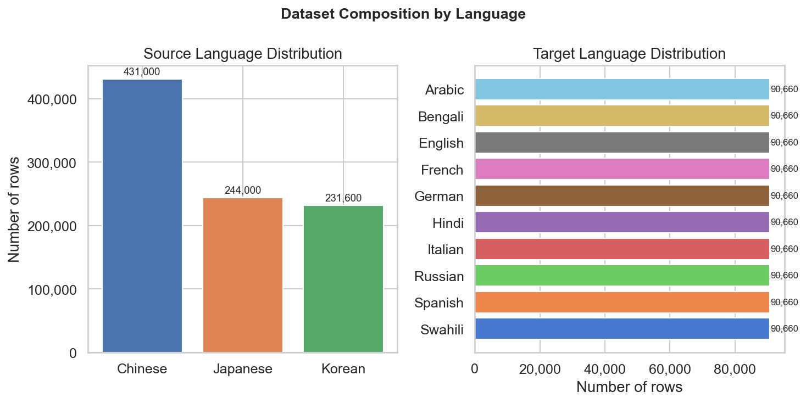

Distribution of rows across source (left) and target (right) languages. Target languages are perfectly balanced (~90,660 rows each), while Chinese contributes nearly half the source sentences.

### 2. Fig2 Idiom Coverage

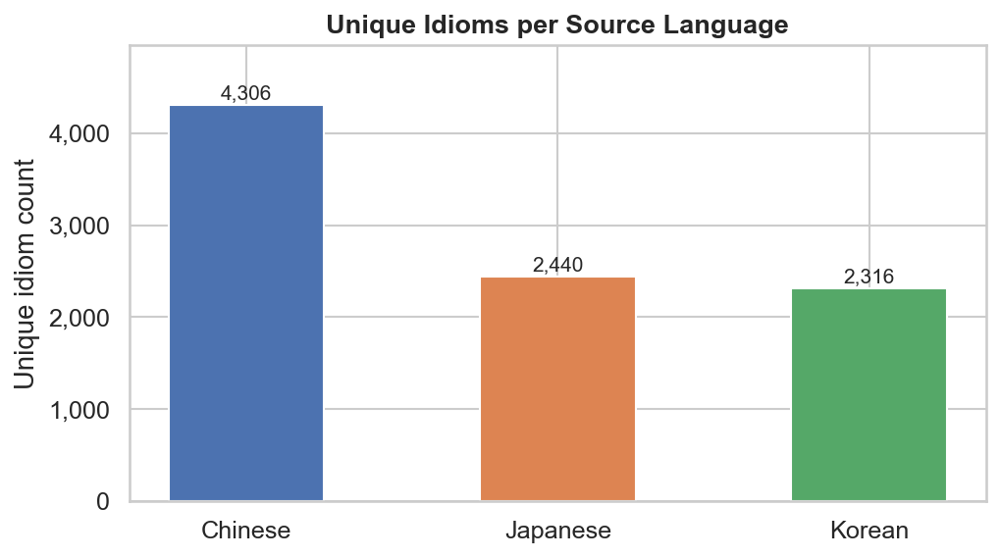

Number of unique idioms per source language. Chinese has the largest inventory (4,306), followed by Japanese (2,440) and Korean (2,316).

### 3. Fig3 Translation Length Violin

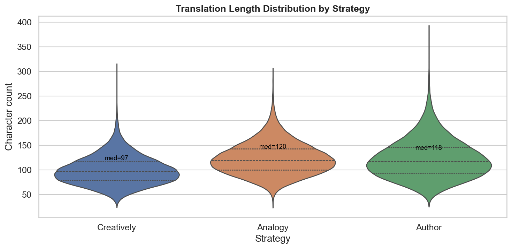

Violin plot of translation lengths (characters) for each strategy on a 50k-row sample. Inner lines show quartiles. Analogy and Author strategies tend to produce longer translations than the Creatively strategy.

### 4. Fig4 Length By Target Language

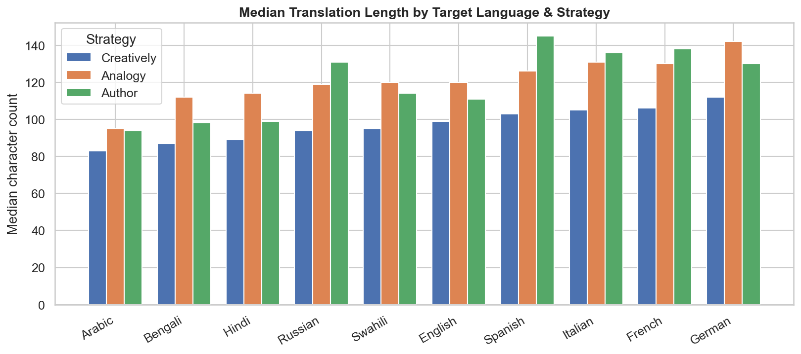

Median character count of each translation strategy grouped by target language. Languages with complex scripts (e.g., Arabic, Bengali, Hindi) tend to have shorter character counts despite equivalent semantic content.

### 5. Fig5 Sentence Length By Source

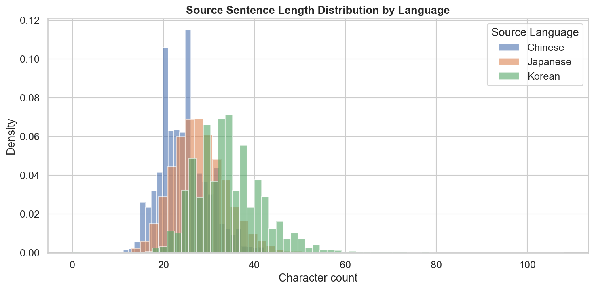

Density histogram of source sentence lengths by language. All three languages show a similar unimodal distribution peaking around 25–30 characters, consistent with the dataset's design of short, idiom-carrying sentences.

### 6. Fig6 Span Length By Strategy

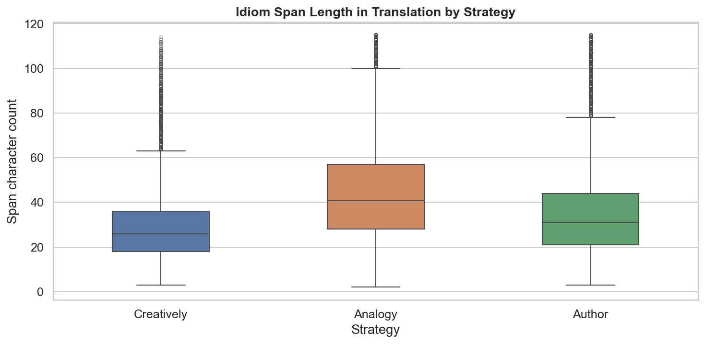

Box plots of the character length of the idiom span identified within each translation. The Analogy strategy produces noticeably longer spans, suggesting more elaborate idiomatic substitutions.

### 7. Fig7 Missing Spans

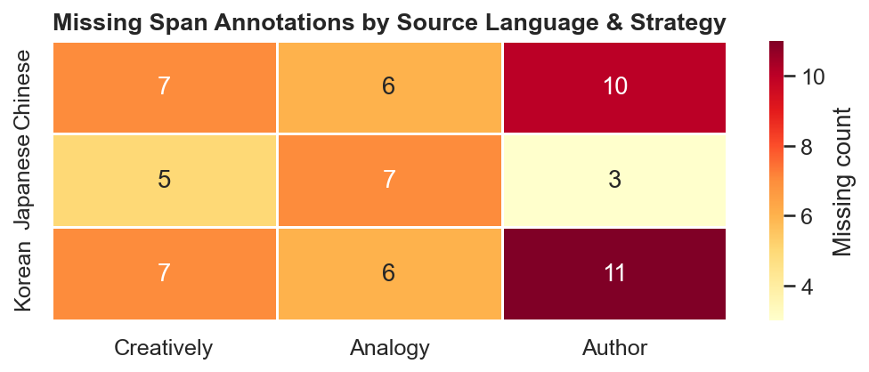

Count of missing span annotations per source language and strategy. Missingness is very low overall (<25 rows) and concentrated in Chinese rows.

## Analysis Results

Results from running analysis scripts on the full dataset (906,600 rows).
See [TODO.md](TODO.md) for future work.

### Table of Contents

| Part | Topic |
|---|---|
| [1. Data Quality](#part-1-data-quality) | Annotation reliability before any analysis |
| [2. Idiom Coverage](#part-2-idiom-coverage) | Which idioms are in IT30 and how well-known are they |
| [3. Translation Behaviour](#part-3-translation-behaviour) | How the model translates: length, structure, diversity, context |
| [4. Cross-Lingual Patterns](#part-4-cross-lingual-patterns) | How target language choice shapes output |
| [5. Cross-Source Cognate Analysis](#part-5-cross-source-cognate-analysis) | Same idiom translated from different source languages |
| [6. Synthesis](#part-6-synthesis) | Composite difficulty score integrating all findings |

---

## Part 1: Data Quality

Before examining translation content, we characterise annotation quality. Each row contains
model-generated span annotations marking where the idiom rendering appears in the translation.
These are the primary quality concern since they are not human-verified.

### Span Annotation Audit

| Check | Creatively | Analogy | Author |
|---|---|---|---|
| Missing span | 19 (0.002%) | 19 (0.002%) | 24 (0.003%) |
| Span not contained in translation | 21,549 (2.38%) | 18,258 (2.01%) | 18,421 (2.03%) |
| Span longer than translation | 329 | 420 | 271 |
| Span equals raw idiom | 155 | 188 | 124 |
| Degenerate translation (= source) | 0 | 0 | 1 |

**5.80% of rows (52,608) carry at least one flag**, almost entirely driven by span-not-in-translation
cases (~2% per strategy). A filtered version can be produced from `data/audit/anomalies.csv`.
The 2% rate motivates a closer look at what these cases actually represent.

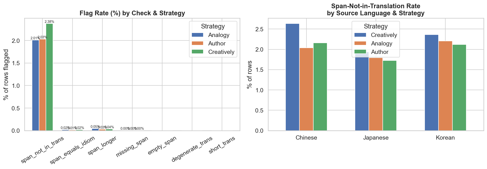

### Span Error Classification

Breakdown of the ~58k flagged rows:

| Category | Creatively | Analogy | Author |
|---|---|---|---|
| Partial word overlap | 16,495 | 14,618 | 14,138 |
| Off-by-one boundary | 1,731 | 1,320 | 1,477 |
| No overlap | 1,613 | 1,009 | 1,363 |
| Case mismatch | 1,267 | 981 | 1,064 |
| Punctuation difference | 435 | 326 | 363 |
| Leading/trailing whitespace | 8 | 4 | 16 |

**~77% are partial word overlap** — the span shares at least one word with the translation but
is not a contiguous substring, most likely because the model paraphrased the idiom across
non-adjacent words. These are annotation artefacts safe to retain for most analyses. The ~7%
"no overlap" cases (≈3,985 flagged pairs across three strategies) are the only ones that warrant
filtering for span-dependent tasks. All analyses below treat flagged rows as-is unless otherwise noted.

---

## Part 2: Idiom Coverage

This part characterises *which* idioms are in IT30 — their structural properties, how they
relate to existing idiom dictionaries, and what categories are intentionally or unintentionally
excluded.

### Idiom Morphology & Structure

| Source language | % 4-character idioms |
|---|---|
| Japanese | 100% |
| Korean | 100% |
| Chinese | 91.4% |

All Japanese and Korean idioms are exactly 4 characters (pure yojijukugo / saseong-eoro).
Chinese has an 8.6% tail of non-4-char chengyu. Structurally, IT30 therefore covers a very
homogeneous slice of each language's idiom space — the "classical four-character" register —
which matters for how we interpret external coverage comparisons below.

Non-4-char Chinese idioms attract slightly higher expansion ratios (4-char: 3.65× vs 7+: 4.33×
for Creatively), suggesting that longer surface forms carry more explicable content. Sentence
length also predicts translation length (Spearman ρ = 0.47–0.67 across source languages and
strategies), confirming that richer context propagates into more verbose translations.

### Overlap with External Idiom Sources

Given the structural uniformity above, we test how well IT30's idiom inventory aligns with
established dictionaries.

**Chinese — chinese-xinhua (31k chengyu):**
- 4,117 / 4,306 IdiomTranslate30 Chinese idioms found in xinhua (**95.6% coverage**)
- 189 unmatched idioms are predominantly non-4-character (only 61.4% are 4-char vs 92.8% for matched)
- 86.7% of xinhua is not in IdiomTranslate30, showing significant room for extension

**Chinese — THUOCL corpus frequencies (8,519 chengyu):**
- 3,441 / 4,306 matched (**79.9% coverage**)
- THUOCL-matched idioms produce *shorter* translations than unmatched ones (Creatively:
  102.6 vs 113.7 chars, p ≈ 0), suggesting rarer chengyu require more elaborate explanation
- Frequency quintile effect on expansion ratio is weak (Spearman ρ ≈ −0.04 to +0.07)

**Chinese — xinhua definition length:**
- Weak positive correlation between definition length and translation length
  (ρ ≈ 0.06–0.13), confirming that semantically richer idioms tend to produce longer translations

**Korean — psyche/korean_idioms (sokdam proverbs):**
- **0% overlap** — confirmed correct. IT30 Korean idioms are exclusively 4-character Hangul
  saseong-eoro (사자성어); psyche/korean_idioms contains multi-word sentence-form sokdam (속담)
  proverbs averaging 10–14 characters. These are categorically distinct idiom types.

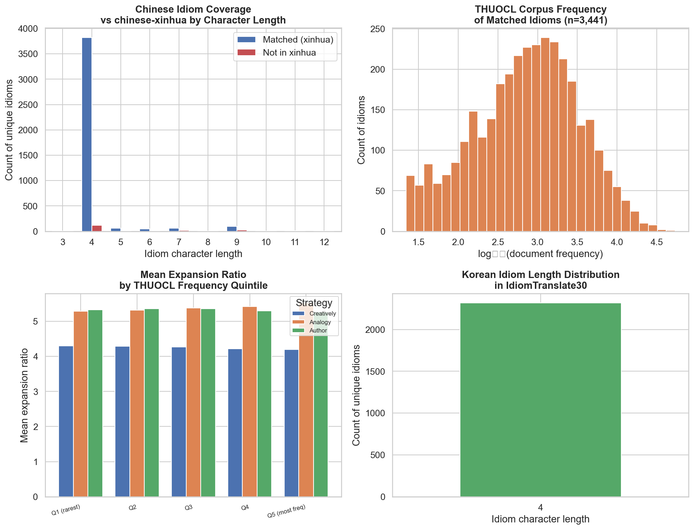
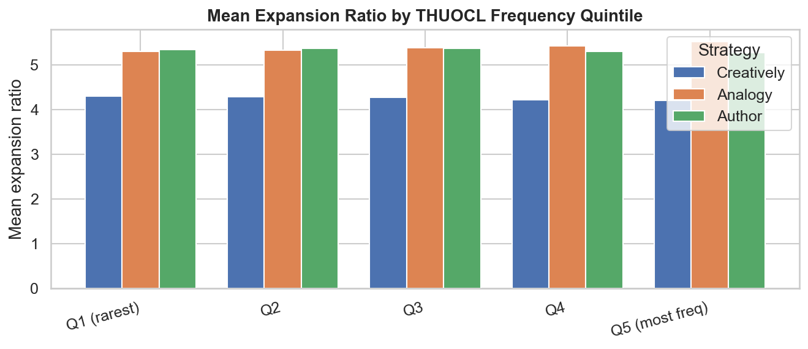

### Unmatched Chinese Idioms

A closer look at the 189 Chinese idioms (4.4%) absent
from chinese-xinhua:

- 116 are 4-char, 22 are 7-char, 23 are 9-char.
- **41 / 189 contain non-CJK characters** (commas, spaces) — multi-clause proverbs mistakenly
  included as chengyu (e.g. "前车之覆，后车之鉴", "说曹操，曹操就到").
- The remaining 148 all-CJK unmatched idioms are likely valid but obscure chengyu absent from
  xinhua's 31k corpus.
- Unmatched idioms produce slightly longer translations (Creatively: 112.7 vs 104.4 chars),
  consistent with the THUOCL finding that rarer idioms require more explanation.

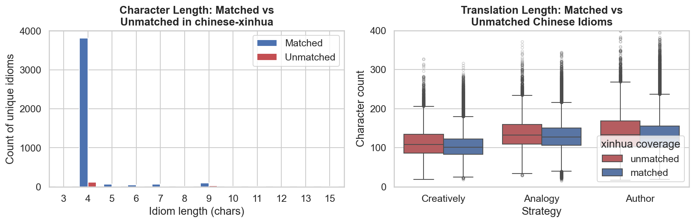

### Japanese Yojijukugo: External Coverage

Reference list built from the kaikki.org English
Wiktionary Japanese dump (360 MB):

- **3,579 unique 4-char CJK entries** extracted; 317 explicitly tagged as 四字熟語/yojijukugo.
- IT30 Japanese ∩ Wiktionary reference: **435 / 2,440 (17.8%)**.
- 2,005 IT30 Japanese idioms (82.2%) are absent from Wiktionary, suggesting IT30 covers many
  obscure or classical yojijukugo not in the English Wiktionary — a stronger skew toward
  rarity than seen for Chinese (4.4% unmatched) or Korean.
- Note: Wiktionary coverage is incomplete; a dedicated 四字熟語辞典 would give a better baseline.

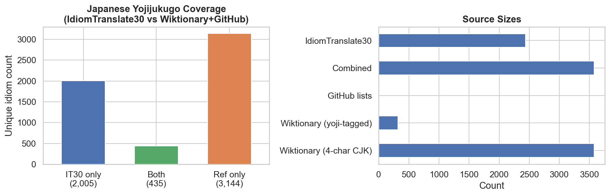

### Complementary Idiom Types

IT30 covers one specific register per language.
To understand what is *excluded*, three structurally different idiom types were characterised:

- **Korean 속담** (`psyche/korean_idioms`): 7,984 sentence-form proverbs, median 14 chars,
  avg 4.7 words. Structurally distinct from saseong-eoro — the 0% string overlap confirms
  these are categorically separate, not just a different slice of the same inventory.
- **Japanese ことわざ** (`sepTN/kotowaza`): 70 entries only (median 7 chars). Rich annotations
  but too small for statistical analysis; a larger kotowaza source remains outstanding.
- **Chinese 歇后语** (`chinese-xinhua/xiehouyu.json`): 14,032 two-part riddle-sayings, median
  6-char riddle portion. Zero overlap with IT30 by design — their riddle-punchline structure
  is incompatible with the single-sentence context format used in IT30.
- Japanese 慣用句 (kan'youku): no freely available dataset found.

The takeaway: IT30 is not a general idiom dataset but a highly specific one — the "classical
four-character" genre of each East Asian language — which should be kept in mind when
generalising findings.

---

## Part 3: Translation Behaviour

With the idiom inventory characterised, we now examine how Gemini 3.0 translates it. The
analyses below ask: how long are translations, what fraction of them carries the idiom
rendering, where in the sentence does the rendering appear, how different are the three
strategies from each other, how lexically varied is the output, and does context actually
change translations or are they largely templated?

### Translation Length & Expansion Ratio

Translations are substantially longer than their source sentences across all strategies:

| Strategy | Median expansion ratio | Mean | Macro-mean (over idioms) |
|---|---|---|---|
| Creatively | 3.59× | 3.68× | 3.68× |
| Analogy | 4.46× | 4.60× | 4.60× |
| Author | 4.36× | 4.55× | 4.55× |

Wilcoxon signed-rank tests (one-sided, Creatively < Analogy/Author) are significant at p < 10⁻³⁰⁰
for every target language. Effect sizes (rank-biserial correlation r = 1 − 2T / (n(n+1)/2))
range 0.55–0.97, largest for Spanish and Russian in the Author strategy. The large expansion
ratios reflect the fundamental challenge of idiom translation: the target must convey figurative
meaning that the source sentence implies rather than states, requiring elaboration.

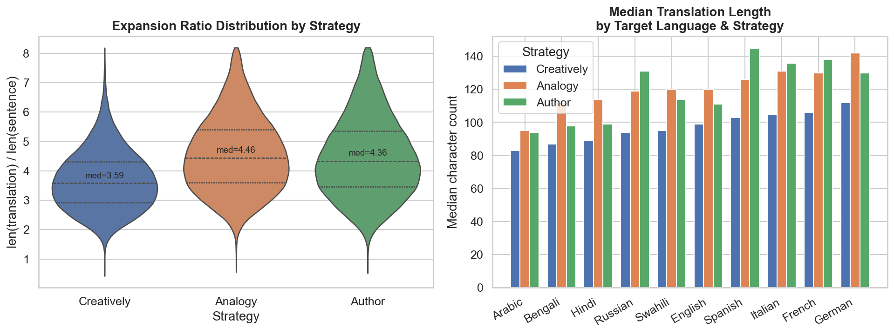
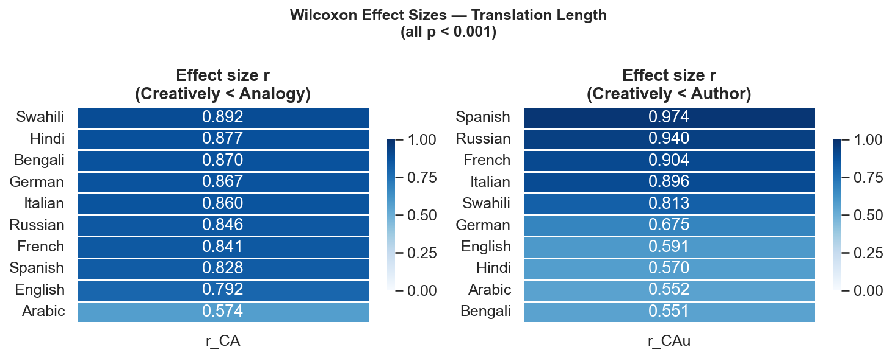

### Span Length & Idiom Footprint

These long translations are not uniformly padded. The idiom span — the model's rendering of
the idiom itself — occupies only a modest fraction of each translation:

| Strategy | Median span/translation ratio |
|---|---|
| Creatively | 0.274 |
| Author | 0.271 |
| Analogy | 0.362 |

Analogy produces substantially longer spans relative to the translation (0.36 vs 0.27),
consistent with its design as an analogy-based strategy that elaborates the idiomatic
substitution. Cross-strategy span length correlations are **low** (Pearson r ≈ 0.22–0.29),
indicating that the three strategies render the idiom in very different surface forms even
when overall translation lengths are similar.

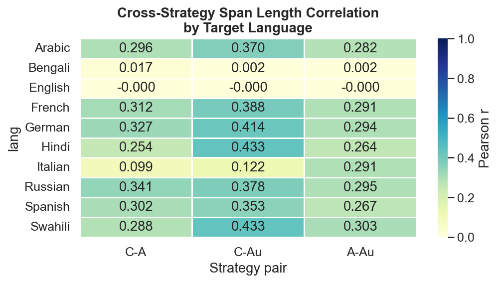

### Span Position Within Translation

Beyond size, the *position* of the span within the translation reveals how sentences are
structured around the idiom rendering. Relative start position is computed as
`start_offset / (translation_len − span_len)`, where 0 = span at the very start, 1 = at the
very end. Rows where the span is not found as a substring (~2% per strategy) are excluded.

| Strategy | Beginning (0–⅓) | Middle (⅓–⅔) | End (⅔–1) |
|---|---|---|---|
| Creatively | 29.9% | 29.1% | 41.0% |
| Analogy | 29.6% | 26.0% | 44.5% |
| Author | 30.2% | 29.6% | 40.3% |

Across all strategies the idiom span **skews toward the end** (~40–45% vs ~30% each for
beginning and middle). This suggests the model tends to introduce context and build up to
the idiomatic expression rather than leading with it — a rhetorical pattern consistent with
how idiomatic expressions function as conclusions or punchlines in natural discourse.

South Asian languages (Bengali 0.478, Hindi 0.488) place the span earliest; Romance and Bantu
languages place it latest (Italian 0.609, Swahili 0.612), reflecting word-order differences
across target languages. Chinese and Korean sources produce later-positioned spans (~0.59)
than Japanese (~0.54).

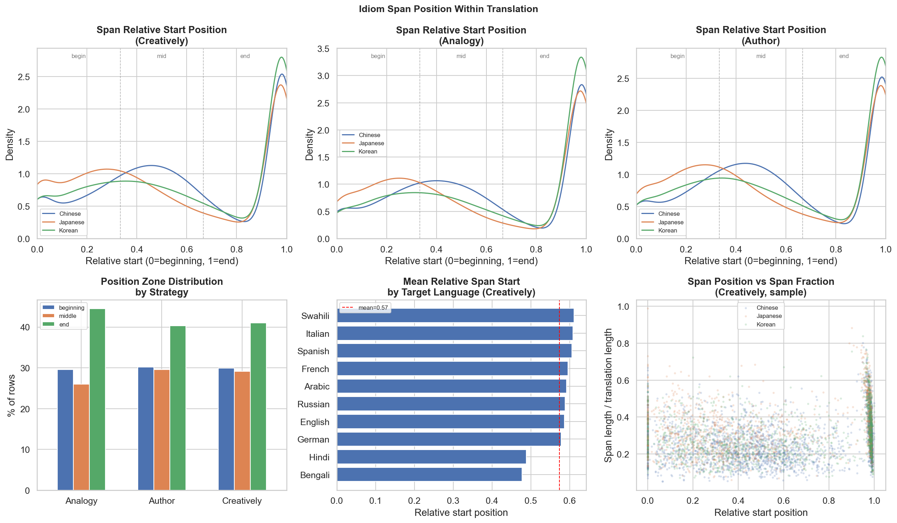

### Strategy Divergence

The three strategies not only produce different span sizes and positions — their full
translations are substantially different from each other:

| Pair | Mean unigram divergence | Mean normalised edit distance |
|---|---|---|
| Creatively → Analogy | 0.604 | 0.574 |
| Creatively → Author | 0.673 | 0.607 |
| Analogy → Author | 0.758 | 0.653 |

Analogy and Author diverge from each other *more* than either diverges from Creatively,
suggesting Creatively occupies a middle ground. Divergence is highest for culturally specific
Japanese idioms (e.g. 和魂洋才, 過剰防衛) and lowest for idioms with widely-known
English equivalents (e.g. 三日天下, 乌合之众) — the model's three strategies converge when
there is a clear conventional rendering and diverge when the idiom requires interpretation.

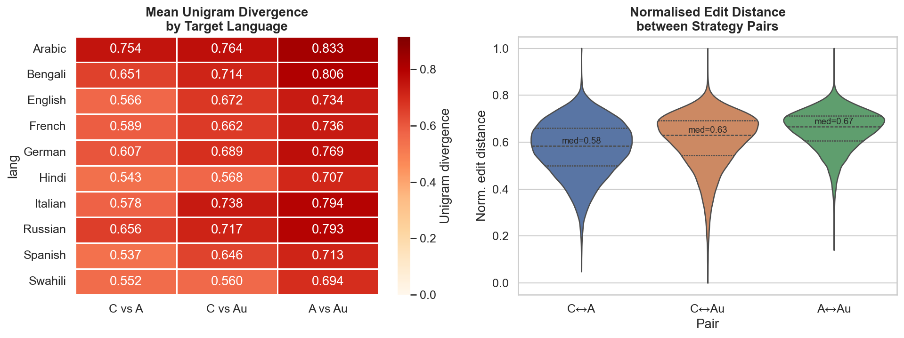
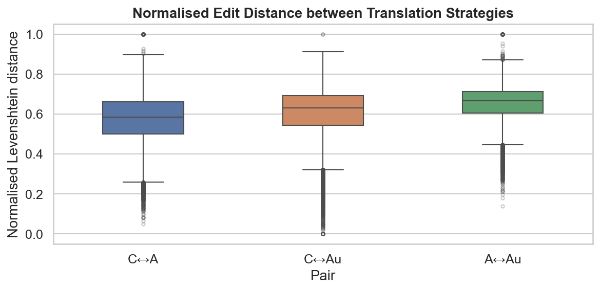

### Lexical Diversity

Strategy divergence is also reflected at the vocabulary level. **Type-token ratios** of
individual translations are very high (median ≈ 1.00 for Creatively, 0.957 for Analogy and
Author), meaning individual translations are short enough that almost every word is unique.
More informative is the span-level lexical breadth across all 10 target languages per idiom:

| Strategy | Mean unique unigrams in spans per idiom |
|---|---|
| Creatively | 280.5 |
| Author | 346.8 |
| Analogy | 512.9 |

Analogy produces nearly twice as many distinct span renderings as Creatively, confirming
it is the most lexically inventive strategy. This is consistent with the strategy divergence
results above: Analogy diverges most from the other strategies and also generates the widest
span vocabulary. Span TTR correlates weakly but positively with full-translation TTR (ρ ≈ 0.15–0.25).

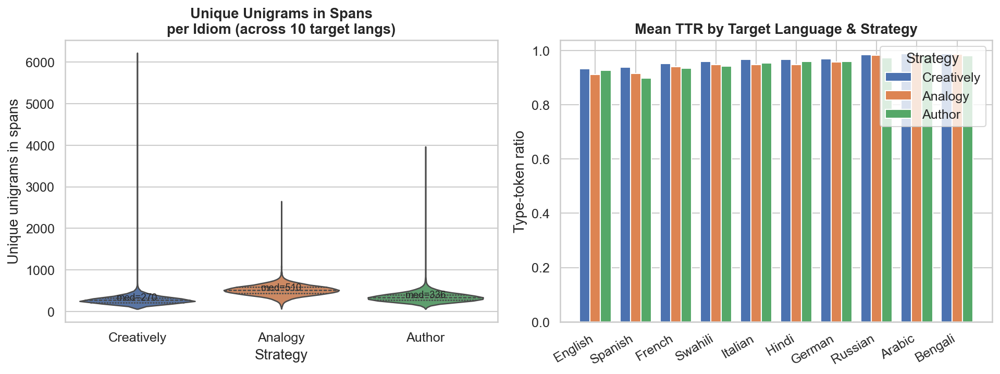

### Context Sensitivity & Span Reuse

The analysis so far treats each row independently. But each (idiom, target language) cell
contains 10 sentences — how much do translations *within* that cell vary? High within-cell
variation means the model genuinely reads and uses context; low variation means it effectively
ignores it and applies a fixed rendering.

**Translation length variation (CV across 10 sentences):**

| Strategy | Mean CV | Median CV | CV > 0.10 |
|---|---|---|---|
| Creatively | 0.206 | 0.201 | 98.7% |
| Analogy | 0.195 | 0.190 | 98.3% |
| Author | 0.219 | 0.213 | 99.0% |

98–99% of cells show non-trivial length variation — **the model is consistently context-sensitive**.
Author is most sensitive (CV 0.219) and Analogy least (0.195), which mirrors their between-strategy
divergence ordering. Word-level diversity within cells confirms the same picture: mean pairwise
Jaccard between the 10 translations within a cell is ~0.08 — any two translations share about
8% of their combined vocabulary, confirming genuine lexical variation across sentences.

**Span reuse across the 10 sentences:**

| Strategy | All-different spans (10 unique) |
|---|---|
| Creatively | 62.3% |
| Analogy | 92.1% |
| Author | 76.4% |

Spans are overwhelmingly **sentence-driven, not idiom-driven**: in 62–92% of cells, every
sentence produces a distinct span. Analogy's 92% fully-unique rate is the flip side of its
high lexical diversity (see Lexical Diversity above) — it not only produces different vocabulary
across target languages but also across sentences for the same target language. No cell achieves full
convergence to a single fixed span, ruling out simple template-based annotation.

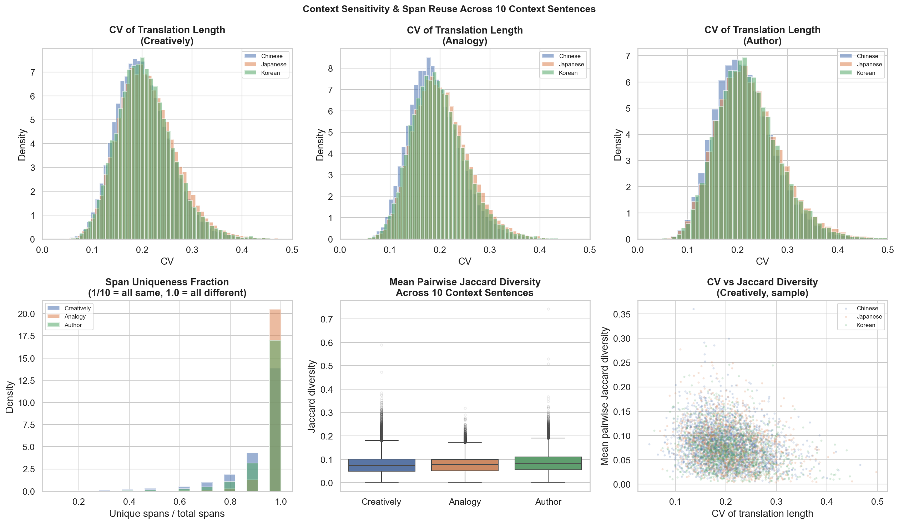

---

## Part 4: Cross-Lingual Patterns

Having characterised how the model translates a given idiom into a given language, we now ask
how much the *choice* of target language matters — and whether language family membership
explains shared vocabulary across translations of the same idiom.

### Cross-Lingual Consistency

The coefficient of variation (CV) of translation length *across* the 10 target languages per
idiom, computed on per-language means (aggregated over the 10 context sentences first):

| Strategy | Mean CV |
|---|---|
| Creatively | 0.108 |
| Analogy | 0.115 |
| Author | 0.165 |

Author shows substantially higher cross-lingual inconsistency (CV 0.165) than the other
two strategies, suggesting its stylistic framing is more sensitive to which target language
is used. This is driven largely by a resource gap: high-resource target languages (English,
French, German, Spanish, Italian, Russian) produce significantly longer translations than
low-resource ones (Arabic, Bengali, Hindi, Swahili), with the gap largest for Author
(~30 chars mean difference, Mann-Whitney p ≈ 0).

> **Note (bug fix):** an earlier version computed CV over raw rows, conflating within-language
> sentence variance with between-language variance, inflating CV by 63–110%. The values
> above are corrected.

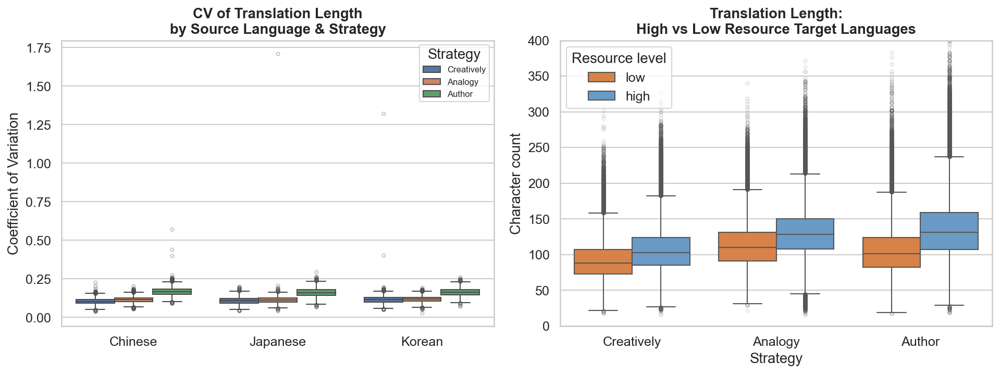

### Cross-Target Language Word Overlap

The cross-lingual consistency analysis shows that translation *length* varies across target languages. We now ask whether *vocabulary* is shared across languages for the same idiom — specifically whether language family predicts shared words.

For each (idiom, strategy), the vocabulary across all 10 sentences is aggregated per target
language (word-set union), then pairwise Jaccard is computed across all 45 language pairs.
Pairs are classified as within-family or between-family.

| Strategy | Within-family Jaccard | Between-family Jaccard |
|---|---|---|
| Creatively | 0.021 | 0.002 |
| Analogy | 0.019 | 0.001 |
| Author | 0.017 | 0.001 |

Within-family overlap is **14–19× higher** than between-family overlap. Between-family Jaccard
has a median of exactly 0.000, confirming near-complete absence of shared vocabulary across
unrelated language families in idiom translations. The Romance triad dominates within-family
overlap: Spanish–Italian (0.041) > French–Spanish (0.033) > French–Italian (0.022). Germanic
pairs score lower (English–German 0.010), reflecting English's greater lexical divergence from
German. Critically, the source language (Chinese, Japanese, Korean) has no detectable effect
on the pattern — cross-target overlap is entirely a property of the target languages.

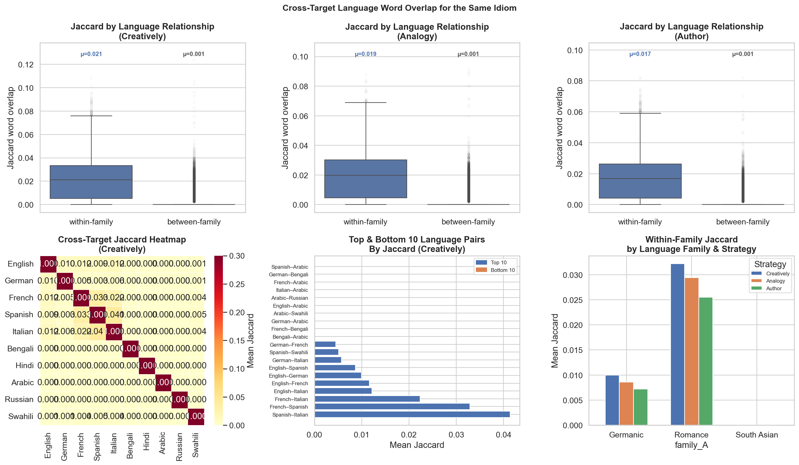

---

## Part 5: Cross-Source Cognate Analysis

Parts 3 and 4 treat each source language independently. A more nuanced question is: when the
*same underlying idiom* appears in multiple source languages (as Sino-Korean and Sino-Japanese
cognates), do translations converge or remain divergent? This tests whether source language
context — the surrounding prose, the script, the cultural framing — shapes the translation
independently of the idiom's meaning.

### ZH–KO Cognate Identification

Chinese simplified idioms are transliterated to predicted
Korean Hangul using a three-layer pipeline: (1) Unihan `kHangul` (authoritative Unicode
per-codepoint readings), (2) OpenCC simplified→traditional conversion for characters absent
from kHangul, (3) `hanja` library as final fallback. Matching uses two tiers: exact (4/4)
and near-3 (3/4 character positions).

| Method | Exact pairs | Near-3 pairs | Total | % of Chinese |
|---|---|---|---|---|
| `hanja` only (old) | 325 | — | 325 | 7.5% |
| 3-layer + near-3 (new) | 293 | 250 | 543 | ~12% |

- **293 exact cognates** (6.8% of Chinese / 12.7% of Korean). Examples: 狐假虎威 ↔ 호가호위,
  束手无策 ↔ 속수무책.
- **250 near-3 pairs** — many mismatches are phonologically systematic, explained by Korean's
  **두음법칙 (Initial Sound Law)**: initial ㄹ shifts to ㅇ/ㄴ (e.g. 流言蜚語 → 류언비어 vs
  유언비어 in standard Korean). Mismatch position is roughly uniform across all 4 character
  positions, indicating no structural bias.
- Span lengths correlate moderately across source languages (exact: ρ = 0.48–0.55; near-3:
  ρ = 0.38–0.53), confirming shared underlying meaning produces similarly-sized renderings.

### Cognate Pair Comparison: ZH–KO

For each of the 543 cognate pairs (293 exact + 250 near-3), rows were aligned by target
language and compared directly (divergence metrics averaged over all 10×10 sentence pairs per
cell). Results cover 5,430 aligned observations.

**Source sentence length:**

| Language | Mean sentence length |
|---|---|
| Chinese | 24.6 chars |
| Korean | 34.6 chars |

Korean source sentences are **10 chars longer** despite encoding the same idiom. Korean Hangul
encodes each CJK syllable as one block but requires additional grammatical particles and
postpositions absent from Chinese, producing longer prose contexts.

**Translation length — Chinese produces longer translations despite shorter sentences:**

| Strategy | ZH mean | KO mean | ZH − KO | p |
|---|---|---|---|---|
| Creatively | 105.2 | 97.3 | +7.9 | 4.8×10⁻¹⁵² |
| Analogy | 127.8 | 118.8 | +8.9 | 1.8×10⁻¹⁷⁵ |
| Author | 131.6 | 119.4 | +12.2 | 2.2×10⁻²¹⁷ |

Chinese-sourced idioms produce **8–12 chars longer translations** across all strategies and all
target languages. The effect is larger for exact cognates (+9.5) than near-3 pairs (+6.2).
Sentence length difference strongly predicts translation length difference (Spearman ρ = 0.73–0.80):
the *longer Korean context* directly drives the model to produce *shorter* explanatory
translations — the model uses context as a substitute for explanation.

**Span length reverses by strategy:**

| Strategy | ZH span | KO span | Difference |
|---|---|---|---|
| Creatively | 33.3 | 43.9 | KO spans +10.7 longer |
| Analogy | 67.5 | 55.5 | ZH spans +12.0 longer |
| Author | 38.2 | 41.3 | ~equal (p = 0.41) |

The reversal between strategies suggests each exploits a different aspect of the culturally
distinct source context. Creatively leans into Korean's richer prose to elaborate the span;
Analogy draws on Chinese's more compact Hanja framing to construct a longer analogy.

**Cross-source divergence:**

| Strategy | Edit distance | Jaccard (word overlap) |
|---|---|---|
| Creatively | 0.745 | 0.054 |
| Analogy | 0.743 | 0.061 |
| Author | 0.740 | 0.064 |

Even for exact cognates, ZH and KO translations of the same idiom into the same target language
share only **5–6% word overlap** and have edit distance ~0.74 — comparable to the *cross-strategy*
divergence within a single source language (0.57–0.65, see Strategy Divergence above). Source language
context shapes translation as strongly as strategy choice does.

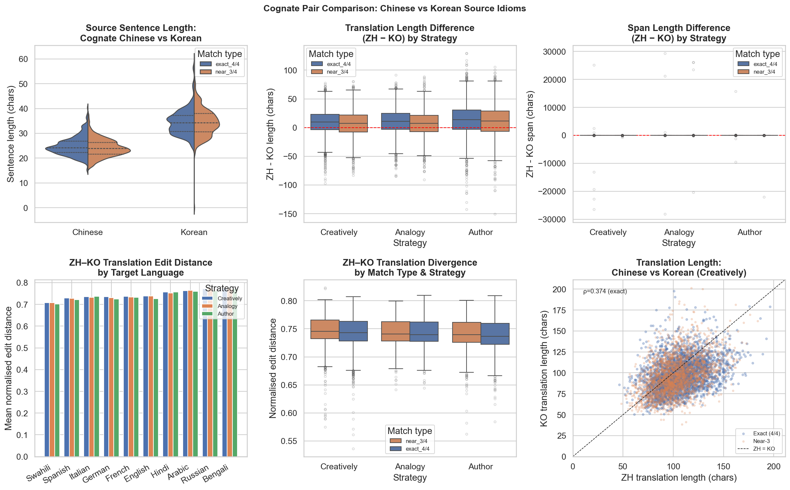
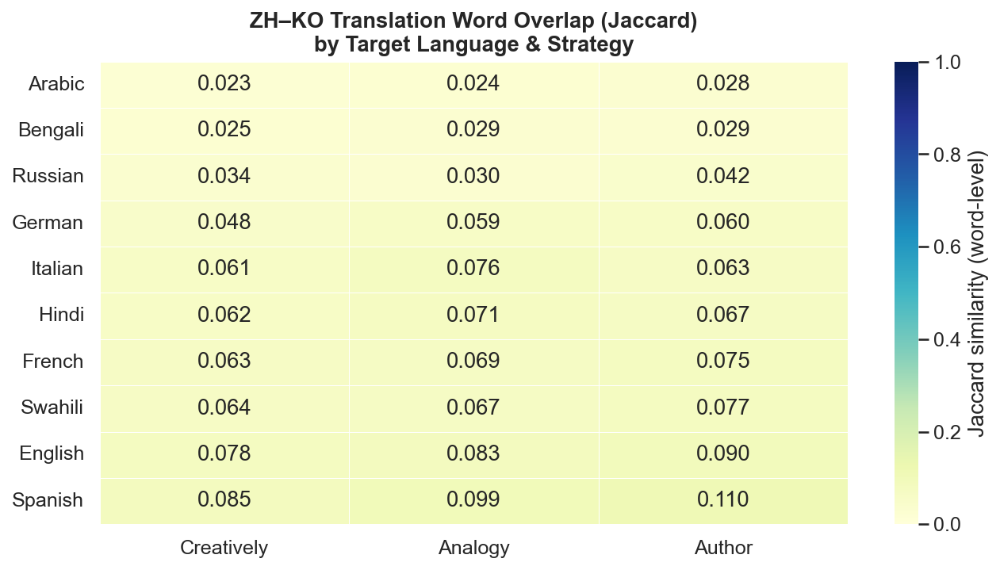

### Extended Cognate Analysis: ZH–JA and KO–JA

The same analysis extended to ZH–JA and KO–JA.

**ZH–JA matching** (OpenCC s2t normalisation of both simplified Chinese and Japanese shinjitai
to traditional Chinese, then exact and near-3 comparison):

| Match type | Pairs | Note |
|---|---|---|
| Exact — trivial duplicates | 113 | Same raw string in both dictionaries (see Data Edge Cases) |
| Exact — genuine cognates | 153 | Different raw forms, identical after s2t normalisation |
| Near-3 | 202 | 3 of 4 characters match after normalisation |
| **Total linguistic pairs** | **355** | Excluding the 113 trivial duplicates |

**KO–JA matching** (Unihan kHangul transliteration of Japanese kanji → predicted Korean, then
exact and near-3 match against Korean saseong-eoro): 548 exact + 254 near-3 = **802 total**.

**Translation length hierarchy — ZH > KO > JA, consistent across all three pairings:**

| Pair | Creatively diff | Analogy diff | Author diff | p |
|---|---|---|---|---|
| ZH − JA | +11.2 | +12.4 | +13.5 | < 10⁻²⁸⁰ |
| KO − JA | +2.5 | +1.9 | +1.6 | < 10⁻⁶ |
| ZH − KO (from above) | +7.9 | +8.9 | +12.2 | < 10⁻¹⁵⁰ |

The ZH–KO gaps above are approximately reproduced by the difference of the ZH–JA and
KO–JA gaps (e.g. Creatively: 11.2 − 2.5 = 8.7 ≈ 7.9), confirming the hierarchy is transitive
and not an artefact of pair selection.

**Cross-source divergence is uniform across directions:**

| Pair | Edit distance | Jaccard (Creatively) |
|---|---|---|
| ZH–JA | 0.733 | 0.071 |
| KO–JA | 0.740 | 0.062 |
| ZH–KO | 0.745 | 0.054 |

All three pairs yield nearly identical edit distances (~0.73–0.74), reinforcing the conclusion
that source-language context produces translation divergence comparable to strategy-level divergence. ZH–JA shows marginally higher word overlap (0.071 vs 0.054 for
ZH–KO), consistent with Chinese and Japanese sharing more literary and scriptural vocabulary
than Chinese and Korean.

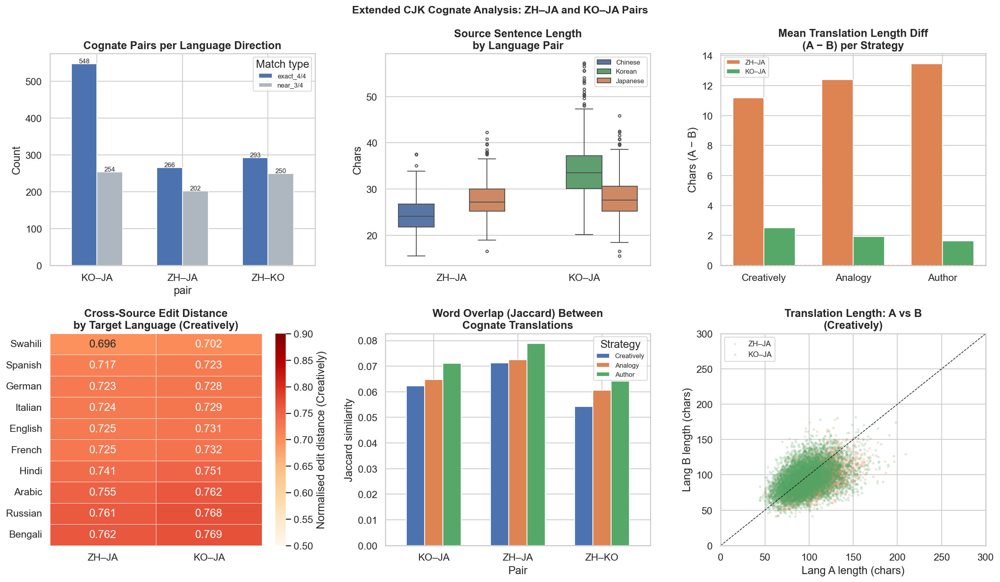

---

## Part 6: Synthesis

This analysis integrates findings from all preceding parts into a single per-idiom
difficulty score, allowing us to identify which properties make an idiom hard to translate and
whether external signals (frequency, dictionary coverage, cognate status) predict this difficulty.

### Idiom-Level Difficulty Composite

Four normalised (0–1) components are averaged equally into
a composite difficulty score for each of the 8,949 idioms:

1. **Cross-strategy divergence** — strategies disagree more on harder idioms
2. **Expansion ratio** — harder idioms require more elaboration
3. **Context sensitivity** — harder idioms produce more variable translations
4. **Cross-target dissimilarity** — harder idioms share less vocabulary across related languages

**Correlates of difficulty (Chinese idioms):**

| Correlate | Spearman ρ | p |
|---|---|---|
| Mean expansion ratio | +0.649 | < 10⁻³⁰⁰ |
| Mean CV (context sensitivity) | +0.529 | < 10⁻³⁰⁰ |
| THUOCL frequency rank | +0.081 | 1.8×10⁻⁶ |
| Xinhua definition length | −0.088 | 1.4×10⁻⁸ |

Expansion ratio and context sensitivity dominate — an idiom is hard to translate if it requires
verbose, variable output. Frequency rank has a small positive effect (rarer idioms are slightly
harder), consistent with the finding above that THUOCL-unmatched idioms produce longer
translations. Longer xinhua definitions correlate weakly with *lower* difficulty: idioms that
dictionaries explain at length may be semantically clearer and therefore easier for the model
to render consistently.

**Cognate membership does not predict difficulty** (ZH–KO: p = 0.44; ZH–JA: p = 0.61). Sharing
a character form with a cognate in another language does not make an idiom easier to translate —
difficulty is driven by cultural interpretability and semantic transparency, not shared script.
(Note: the ZH–JA set includes the 113 trivial dictionary duplicates; excluding them does not
change the result.)

**4-character Chinese idioms are harder than non-4-character ones** (mean 0.529 vs 0.499,
p < 10⁻²⁰). Multi-clause proverbs are more self-explanatory in their surface form — they
state their meaning explicitly, leaving less for the model to interpret and elaborate.

**Hardest idioms** (top examples): 推荐让能, 强奸民意, 文恬武嬉 — culturally specific
concepts with no direct equivalents in most target languages. Note: the top two are also the
zero-sentence idioms identified in the Data Edge Cases section; their inflated difficulty
scores are artefacts of hallucinated translations rather than genuine idiom complexity.

**Easiest idioms**: 海底捞月 (fishing the moon from the sea), 一箭双雕 (one arrow two eagles),
晴天霹雳 (thunderbolt from clear sky) — highly imageable universal metaphors that map cleanly
to stable conventional equivalents across all 10 target languages.

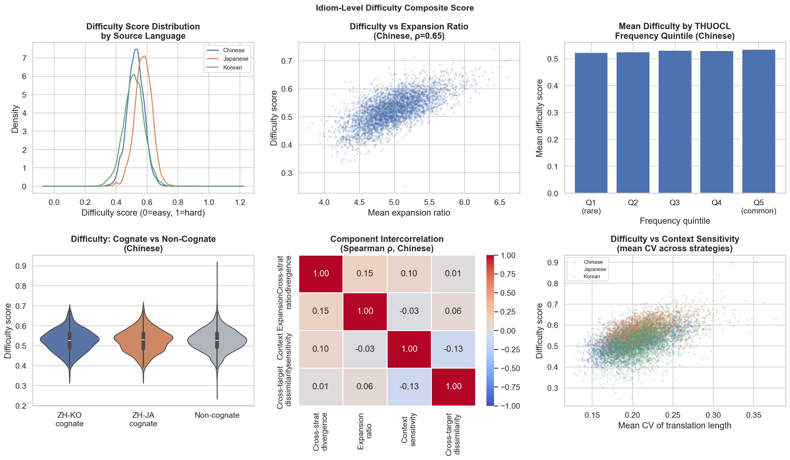
