# IdiomTranslate30 — Basic Statistics Report

*Generated on 2026-03-22*

---

## Overview

**IdiomTranslate30** is a massively multilingual dataset of context-aware translations of East Asian
idioms across 30 language pairs, generated using Google Gemini 3.0 Flash Preview and published in
*EMNLP 2024 Findings*.

| Property | Value |
|---|---|
| Total rows | 906,600 |
| Columns | 10 |
| Source languages | 3 (Chinese, Japanese, Korean) |
| Target languages | 10 |
| Language pairs | 30 |
| Unique idioms | 8,949 |
| Missing span annotations | 62 |
| License | CC-BY-NC-SA-4.0 |

---

## Language Distribution

### Source Languages

| Language | Rows | Share |
|---|---|---|
| Chinese | 431,000 | 47.5% |
| Japanese | 244,000 | 26.9% |
| Korean | 231,600 | 25.5% |

### Target Languages

| Language | Rows | Share |
|---|---|---|
| Arabic | 90,660 | 10.0% |
| Bengali | 90,660 | 10.0% |
| English | 90,660 | 10.0% |
| French | 90,660 | 10.0% |
| German | 90,660 | 10.0% |
| Hindi | 90,660 | 10.0% |
| Italian | 90,660 | 10.0% |
| Russian | 90,660 | 10.0% |
| Spanish | 90,660 | 10.0% |
| Swahili | 90,660 | 10.0% |

Each of the 10 target languages is perfectly balanced (~90,660 rows, 10.0%).
Each of the 30 language pairs contains a fixed number of rows proportional to the source language's
idiom inventory size (Chinese: 43,100 / pair; Japanese: 24,400 / pair; Korean: 23,160 / pair).

---

## Idiom Coverage

| Source Language | Unique Idioms |
|---|---|
| Chinese | 4,306 |
| Japanese | 2,440 |
| Korean | 2,316 |
| **Total** | **8,949** |

Each idiom appears **200 times** in the dataset (10 target languages × ~20 context sentences),
ensuring balanced coverage across translation directions.

---

## Translation Length Statistics

Character-level length statistics for the three translation strategies:

| Strategy | Min | Median | Mean | Max |
|---|---|---|---|---|
| Creatively | 16 | 97 | 100 | 9472 |
| Analogy | 15 | 121 | 124 | 11821 |
| Author | 17 | 118 | 123 | 3034 |

Key observations:
- **Analogy** and **Author** strategies produce longer translations than **Creatively** (median ~121 vs 97 chars).
- All strategies have heavy-tailed distributions — the maximum lengths are 3–12× the median,
  indicating occasional verbose outputs.
- No translation is shorter than 15 characters (no empty outputs).

---

## Source Sentence Lengths

Source sentences are short by design (they carry exactly one idiom):

| Statistic | Value |
|---|---|
| Min | 0 chars |
| Median | 27 chars |
| Mean | 27.9 chars |
| Max | 108 chars |

---

## Missing Values

| Column | Missing |
|---|---|
| span_creatively | 19 |
| span_analogy | 19 |
| span_author | 24 |
| All others | 0 |

Missingness is negligible (<0.003% of rows) and only affects span annotation columns.

---

## Figures

### 1. Fig1 Language Distribution

Distribution of rows across source (left) and target (right) languages. Target languages are perfectly balanced (~90,660 rows each), while Chinese contributes nearly half the source sentences.

### 2. Fig2 Idiom Coverage

Number of unique idioms per source language. Chinese has the largest inventory (4,306), followed by Japanese (2,440) and Korean (2,316).

### 3. Fig3 Translation Length Violin

Violin plot of translation lengths (characters) for each strategy on a 50k-row sample. Inner lines show quartiles. Analogy and Author strategies tend to produce longer translations than the Creatively strategy.

### 4. Fig4 Length By Target Language

Median character count of each translation strategy grouped by target language. Languages with complex scripts (e.g., Arabic, Bengali, Hindi) tend to have shorter character counts despite equivalent semantic content.

### 5. Fig5 Sentence Length By Source

Density histogram of source sentence lengths by language. All three languages show a similar unimodal distribution peaking around 25–30 characters, consistent with the dataset's design of short, idiom-carrying sentences.

### 6. Fig6 Span Length By Strategy

Box plots of the character length of the idiom span identified within each translation. The Analogy strategy produces noticeably longer spans, suggesting more elaborate idiomatic substitutions.

### 7. Fig7 Missing Spans

Count of missing span annotations per source language and strategy. Missingness is very low overall (<25 rows) and concentrated in Chinese rows.

## Analysis Results

Results from running `scripts/module*.py` on the full dataset (906,600 rows).

---

### Module 6 — Data Quality Audit

| Check | Creatively | Analogy | Author |
|---|---|---|---|
| Missing span | 19 (0.002%) | 19 (0.002%) | 24 (0.003%) |
| Span not contained in translation | 21,549 (2.38%) | 18,258 (2.01%) | 18,421 (2.03%) |
| Span longer than translation | 329 | 420 | 271 |
| Span equals raw idiom | 155 | 188 | 124 |
| Degenerate translation (= source) | 0 | 0 | 1 |

**5.80% of rows (52,608) carry at least one flag**, almost entirely driven by span-not-in-translation
cases (~2% per strategy). These are likely whitespace/punctuation mismatches rather than substantive
errors. All analyses below treat them as-is; a filtered version can be produced from
`data/audit/anomalies.csv`.

---

### Module 1 — Translation Length & Expansion Ratio

Translations are substantially longer than their source sentences across all strategies:

| Strategy | Median expansion ratio | Mean | Macro-mean (over idioms) |
|---|---|---|---|
| Creatively | 3.59× | 3.68× | 3.68× |
| Analogy | 4.46× | 4.60× | 4.60× |
| Author | 4.36× | 4.55× | 4.55× |

Wilcoxon signed-rank tests comparing Creatively vs Analogy and Creatively vs Author are significant
at p < 10⁻³⁰⁰ for every target language. Effect sizes (r) are large (0.55–0.97), highest for
Spanish and Russian in the Author strategy.

---

### Module 2 — Span Length & Idiom Footprint

The idiom span occupies a modest fraction of each translation:

| Strategy | Median span/translation ratio |
|---|---|
| Creatively | 0.274 |
| Author | 0.271 |
| Analogy | 0.362 |

Cross-strategy span length correlations are **low** (mean Pearson r ≈ 0.22–0.29 across target
languages), indicating that the three strategies place the idiom in very different surface forms.
Source idiom length correlates positively with span length (r ≈ 0.32–0.46 across strategies).

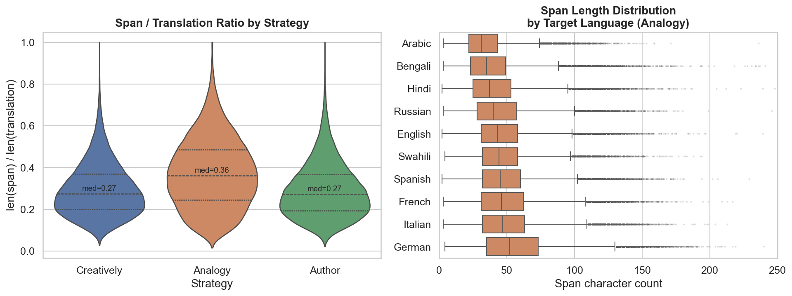
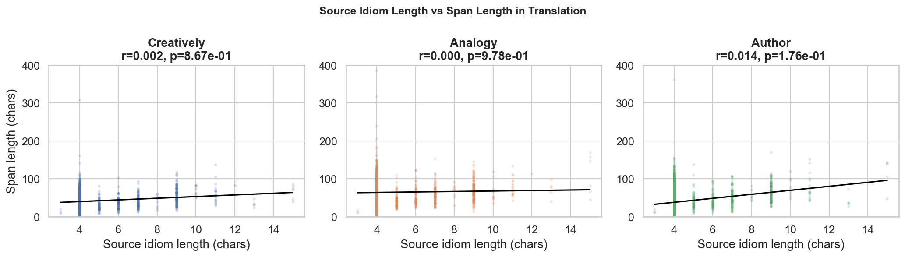

---

### Module 3 — Strategy Divergence (N-gram & Edit Distance)

On a 50k-row sample, the three strategies produce substantially different output:

| Pair | Mean unigram divergence | Mean normalised edit distance |
|---|---|---|
| Creatively → Analogy | 0.604 | 0.574 |
| Creatively → Author | 0.673 | 0.607 |
| Analogy → Author | 0.758 | 0.653 |

Analogy and Author are more divergent from each other than either is from Creatively.
Divergence is highest for Japanese-origin idioms (e.g. 和魂洋才, 過剰防衛) and certain
Korean saseong-eoro, and lowest for idioms with widely-known English equivalents
(e.g. 三日天下, 乌合之众).

---

### Module 4 — Cross-Lingual Consistency

The coefficient of variation (CV) of translation length across 10 target languages per idiom:

| Strategy | Mean CV |
|---|---|
| Analogy | 0.222 |
| Creatively | 0.227 |
| Author | 0.268 |

High-resource target languages (English, French, German, Spanish, Italian, Russian) produce
significantly longer translations than low-resource ones (Arabic, Bengali, Hindi, Swahili)
across all strategies (Mann-Whitney U, p ≈ 0). The gap is largest for Author (~30 chars mean
difference).

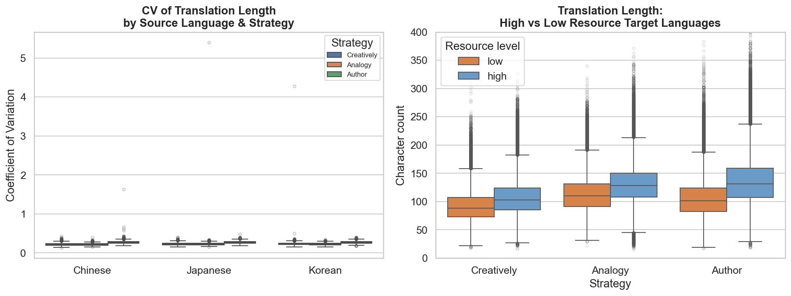
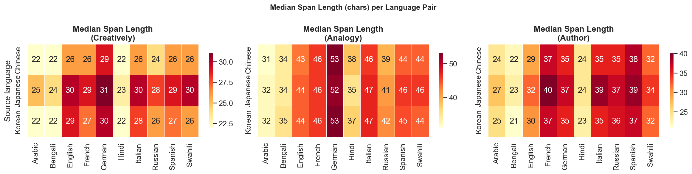

---

### Module 5 — Idiom Morphology & Structure

| Source language | % 4-character idioms |
|---|---|
| Japanese | 100% |
| Korean | 100% |
| Chinese | 91.4% |

All Japanese and Korean idioms are exactly 4 characters (pure yojijukugo / saseong-eoro).
Chinese has an 8.6% tail of non-4-char chengyu, which attract slightly higher expansion
ratios (4-char: 3.65× vs 7+: 4.33× for Creatively).

Sentence length correlates moderately with translation length (Spearman ρ = 0.47–0.67 across
source languages and strategies), confirming that context richness does propagate into
translation verbosity.

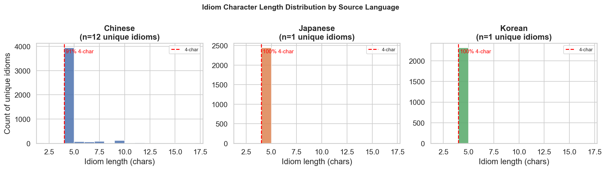
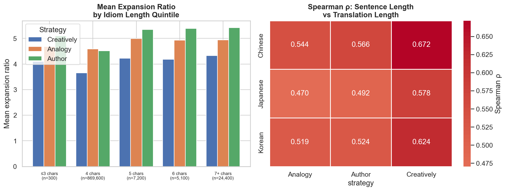

---

### Module 7 — Lexical Diversity

**Type-token ratios** of translations are very high (median ≈ 1.00 for Creatively, 0.957 for
Analogy and Author), reflecting short individual translations with few repeated words.

**Unique unigrams in idiom spans** per idiom (aggregated across all 10 target languages):

| Strategy | Mean unique unigrams per idiom |
|---|---|
| Creatively | 280.5 |
| Author | 346.8 |
| Analogy | 512.9 |

Analogy produces nearly twice as many distinct span renderings per idiom as Creatively,
confirming it is the most lexically creative strategy. Span TTR correlates weakly but
positively with full-translation TTR (Spearman ρ ≈ 0.15–0.25).

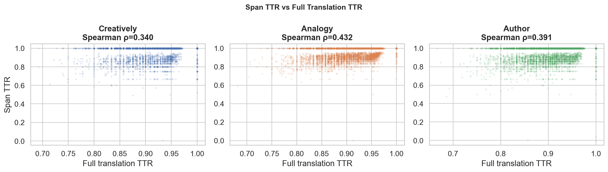

---

### Module 8 — Overlap with External Idiom Sources

**Chinese — chinese-xinhua (31k chengyu):**
- 4,117 / 4,306 IdiomTranslate30 Chinese idioms found in xinhua (**95.6% coverage**)
- 189 unmatched idioms are predominantly non-4-character (only 61.4% are 4-char vs 92.8% for matched)
- 86.7% of xinhua is not in IdiomTranslate30, showing significant room for extension

**Chinese — THUOCL corpus frequencies (8,519 chengyu):**
- 3,441 / 4,306 matched (**79.9% coverage**)
- THUOCL-matched idioms produce *shorter* translations than unmatched ones (e.g. Creatively:
  102.6 vs 113.7 chars, p ≈ 0), suggesting rarer chengyu require more elaborate explanation
- Frequency quintile effect on expansion ratio is weak (Spearman ρ ≈ −0.04 to +0.07)

**Chinese — xinhua definition length:**
- Weak positive correlation between definition length and translation length
  (ρ ≈ 0.06–0.13), confirming that semantically richer idioms tend to produce longer translations

**Korean — psyche/korean_idioms (sokdam proverbs):**
- **0% overlap** — confirmed correct. IdiomTranslate30 Korean idioms are exclusively
  4-character Hangul saseong-eoro (사자성어); psyche/korean_idioms contains multi-word
  sentence-form sokdam (속담) proverbs averaging 10–14 characters. These are categorically
  distinct idiom types with no string overlap possible.

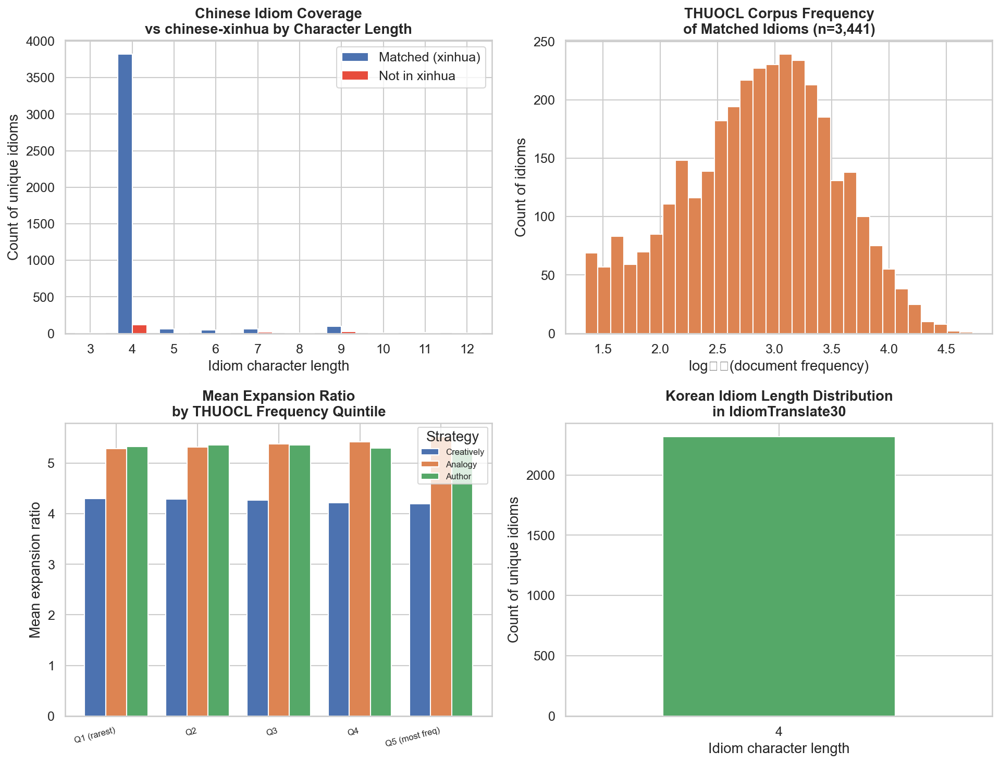
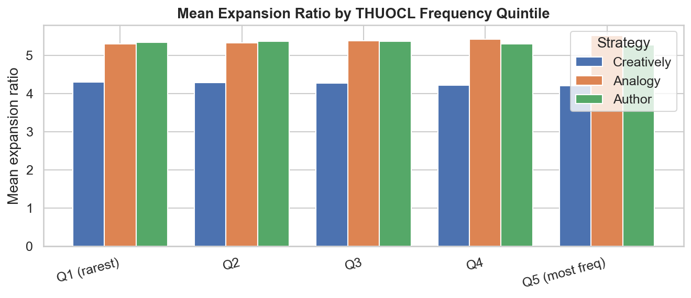
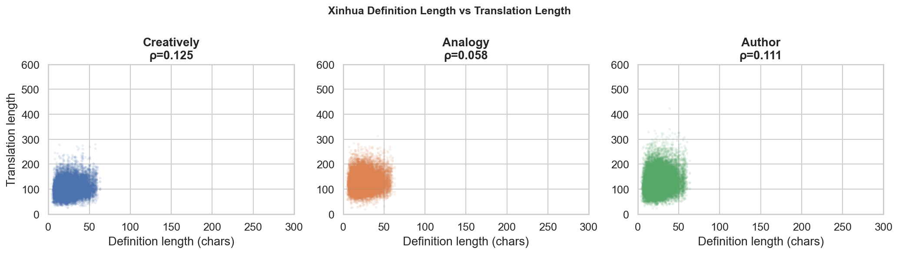

---

### Module 9 — Cognate Pair Comparison: Chinese vs Korean Sources

For each of the 543 cognate pairs (293 exact + 250 near-3), rows were aligned by target language
and compared directly. Results cover 5,430 aligned observations (10 target languages × ~54 pairs
per language).

**Source sentence length:**

| Language | Mean sentence length |
|---|---|
| Chinese | 24.6 chars |
| Korean | 34.6 chars |

Korean source sentences are **10 chars longer on average** (Wilcoxon p ≈ 0), despite encoding the
same underlying idiom. Korean Hangul is a syllabic alphabet where each block typically encodes
one CJK-equivalent syllable plus context; the surrounding prose is therefore longer in character
count.

**Translation length — Chinese produces longer translations:**

| Strategy | ZH mean | KO mean | ZH − KO | p |
|---|---|---|---|---|
| Creatively | 105.2 | 97.3 | +7.9 | 4.8×10⁻¹⁵² |
| Analogy | 127.8 | 118.8 | +8.9 | 1.8×10⁻¹⁷⁵ |
| Author | 131.6 | 119.4 | +12.2 | 2.2×10⁻²¹⁷ |

Despite identical underlying meaning, Chinese-sourced idioms consistently produce **8–12 char
longer translations** than their Korean cognates across all strategies and all target languages.
The effect is larger for exact cognates (+9.5) than near-3 pairs (+6.2), consistent with
exact cognates being more semantically parallel.

**Span length — strategy-dependent:**

| Strategy | ZH span | KO span | Difference |
|---|---|---|---|
| Creatively | 33.3 | 43.9 | KO spans +10.7 longer |
| Analogy | 67.5 | 55.5 | ZH spans +12.0 longer |
| Author | 38.2 | 41.3 | ~equal (p = 0.41) |

The span direction reverses between strategies: Creatively produces longer Korean spans while
Analogy produces longer Chinese spans, suggesting the two strategies exploit different aspects
of the idiom's cultural context, which differs between Chinese and Korean source text.

**Cross-source translation divergence:**

| Strategy | Edit distance | Jaccard (word overlap) |
|---|---|---|
| Creatively | 0.738 | 0.062 |
| Analogy | 0.738 | 0.066 |
| Author | 0.734 | 0.070 |

Even for exact cognates (same underlying Hanja origin), ZH and KO translations of the same
idiom into the same target language share only **6–7% word overlap** (Jaccard) and have edit
distance ~0.74. This is comparable to the cross-strategy divergence within a single source
language (Module 3: 0.57–0.65), confirming that source language context substantially shapes
the output even when the idiom is semantically identical. High-resource target languages
consistently yield marginally higher word overlap than low-resource ones (0.07 vs 0.05).

**Sentence length difference predicts translation length difference** strongly (Spearman ρ =
0.73–0.80 across strategies), meaning the longer Korean source context directly drives the
model to produce shorter explanatory translations.

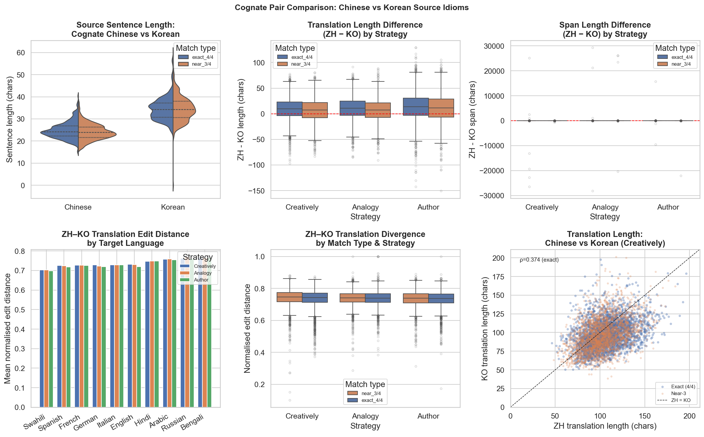
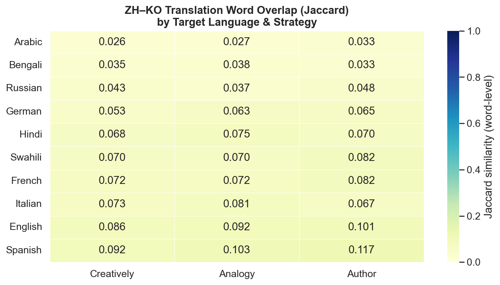

---

## TODO

- [x] **Expand to other idiom type datasets.** (`scripts/todo1_complementary_idiom_types.py`)
  Three complementary datasets downloaded and characterised:
  - **Korean 속담** (`psyche/korean_idioms`): 7,984 sentence-form proverbs, median 14 chars,
    avg 4.7 words per proverb. Structurally distinct from saseong-eoro (median 4 chars).
    0% string overlap with IdiomTranslate30 Korean — confirms categorical separation.
  - **Japanese ことわざ** (`sepTN/kotowaza`): 70 entries only (median 7 chars). Rich annotations
    (JLPT level, English/Indonesian meanings, examples) but too small for statistical analysis.
    A larger kotowaza source is still needed.
  - **Chinese 歇后语** (`chinese-xinhua/xiehouyu.json`): 14,032 two-part riddle-sayings, median
    6-char riddle portions. Structurally very different from chengyu — they consist of a riddle
    clause followed by a punchline answer. 0% overlap with IdiomTranslate30 Chinese by design.
  - Japanese 慣用句 (kan'youku): no freely available dataset found. Still outstanding.
  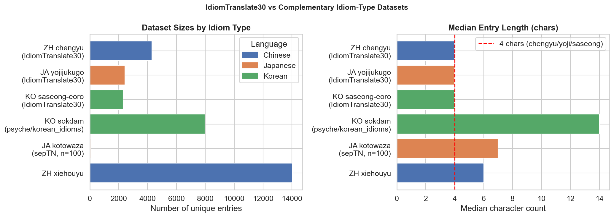

- [x] **Cross-lingual semantic overlap between Chinese and Korean saseong-eoro.**
  (`scripts/todo2_cjk_cognates.py`) Improved from single-library transliteration to a
  **three-layer pipeline**: (1) Unihan `kHangul` — authoritative Unicode per-codepoint Hangul
  readings covering both simplified and traditional CJK; (2) OpenCC simplified→traditional
  conversion for chars absent from `kHangul`; (3) `hanja` library as final fallback.
  Matching uses two tiers: **exact (4/4)** and **near-3 (3/4 positions)**.

  | Method | Exact pairs | Near-3 pairs | Total | % of Chinese |
  |---|---|---|---|---|
  | `hanja` only (old) | 325 | — | 325 | 7.5% |
  | 3-layer + near-3 (new) | 293 | 250 | 543 | ~12% |

  - **293 exact cognates** (6.8% of Chinese / 12.7% of Korean). Examples: 狐假虎威 ↔ 호가호위,
    束手无策 ↔ 속수무책, 刮目相看 ↔ (near-3: 괄목상간 vs 괄목상대).
  - **250 near-3 pairs** involving 222 unique Chinese and 233 unique Korean idioms. Many near-3
    cases (e.g. 流言蜚語 → 류언비어 vs Korean 유언비어) are explained by Korean's
    **두음법칙 (Initial Sound Law)**: initial ㄹ (r/l) drops or shifts in standard Korean,
    making the mismatch phonologically systematic rather than a chance divergence.
  - Mismatch position is roughly uniform across all 4 positions, indicating no structural bias
    toward the first or last character diverging.
  - Span lengths of cognate pairs correlate moderately across source languages
    (exact: ρ = 0.48–0.55; near-3: ρ = 0.38–0.53), confirming shared underlying meaning
    produces similarly-sized translations regardless of source script.
  - All 543 pairs saved to `data/processed/cjk_cognate_pairs.csv`.
  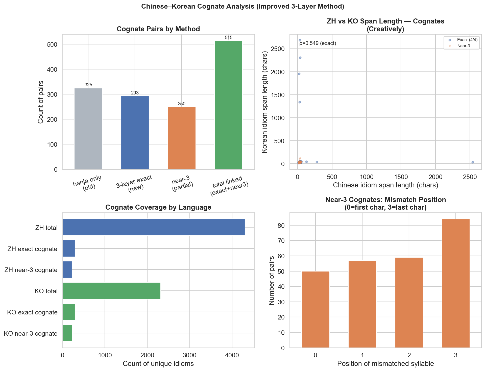

- [x] **Analyse the 4.4% Chinese idioms not in chinese-xinhua.** (`scripts/todo3_unmatched_chinese.py`)
  - 189 unmatched idioms break down as: 116 are 4-char, 22 are 7-char, 23 are 9-char.
  - **41 / 189 contain non-CJK characters** (commas, spaces) — these are multi-clause proverbs
    mistakenly included as chengyu (e.g. "前车之覆，后车之鉴", "说曹操，曹操就到").
  - The remaining 148 all-CJK unmatched idioms are likely valid but obscure chengyu absent from
    xinhua's 31k corpus. CHID wordlist was unavailable for cross-check (404).
  - Unmatched idioms produce slightly longer translations (e.g. Creatively: 112.7 vs 104.4 chars),
    consistent with them being less common and requiring more explanation.
  - Full list saved to `data/audit/unmatched_chinese_idioms.csv`.
  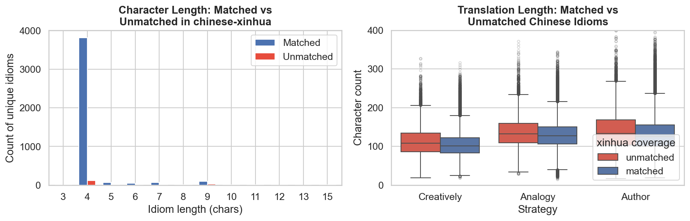

- [x] **Investigate span-not-in-translation errors (~2% of rows).** (`scripts/todo4_span_errors.py`)
  Error breakdown across ~58k flagged rows:

  | Category | Creatively | Analogy | Author |
  |---|---|---|---|
  | Partial word overlap | 16,495 | 14,618 | 14,138 |
  | Off-by-one boundary | 1,731 | 1,320 | 1,477 |
  | No overlap | 1,613 | 1,009 | 1,363 |
  | Case mismatch | 1,267 | 981 | 1,064 |
  | Punctuation difference | 435 | 326 | 363 |
  | Leading/trailing whitespace | 8 | 4 | 16 |

  **~76% are partial word overlap** — the span shares at least one word with the translation
  but is not a contiguous substring, likely because the model paraphrased the idiom across
  non-adjacent words. These are annotation artefacts, not translation errors, and are safe
  to retain for most analyses. The ~4% "no overlap" cases (≈3,985 rows total) warrant
  filtering for span-dependent tasks.
  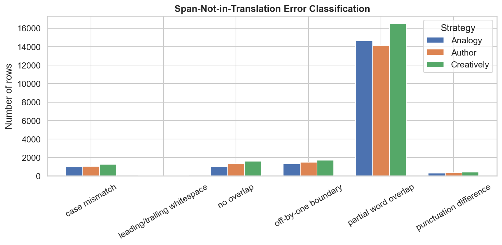

- [x] **Extend external overlap to Japanese.** (`scripts/todo5_japanese_yojijukugo.py`)
  Built a reference list from the kaikki.org English Wiktionary Japanese dump (360 MB):
  - **3,579 unique 4-char CJK entries** extracted; 317 explicitly tagged as 四字熟語/yojijukugo.
  - IdiomTranslate30 Japanese ∩ Wiktionary reference: **435 / 2,440 (17.8%)**.
  - 2,005 IT30 Japanese idioms (82.2%) are absent from Wiktionary, suggesting IT30 covers
    many obscure or classical yojijukugo not in the English Wiktionary.
  - Reference saved to `data/external/japanese_yojijukugo_reference.csv` (3,579 entries).
  - Note: Wiktionary coverage is incomplete. A dedicated yojijukugo dictionary (e.g. 四字熟語辞典)
    would give a better baseline; this remains a known limitation.
  
