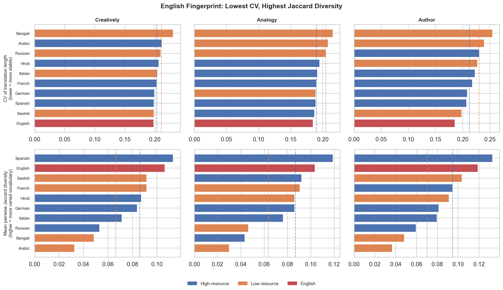
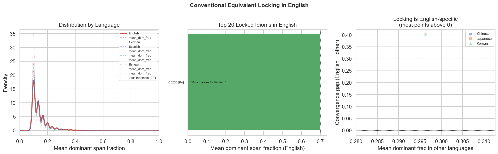
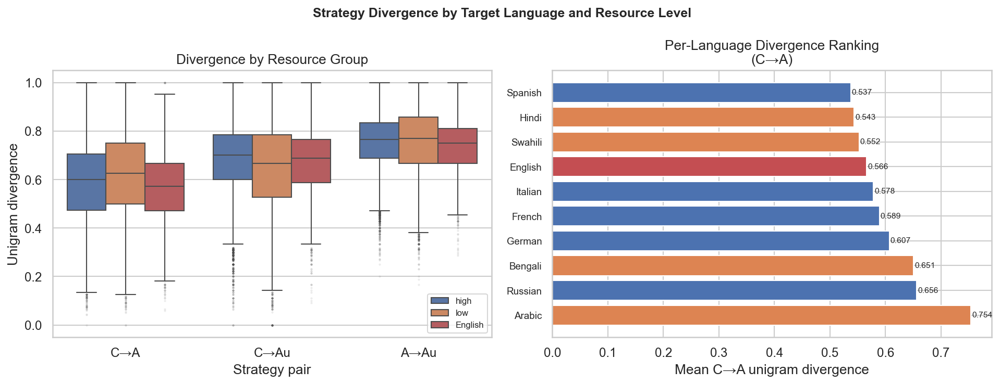
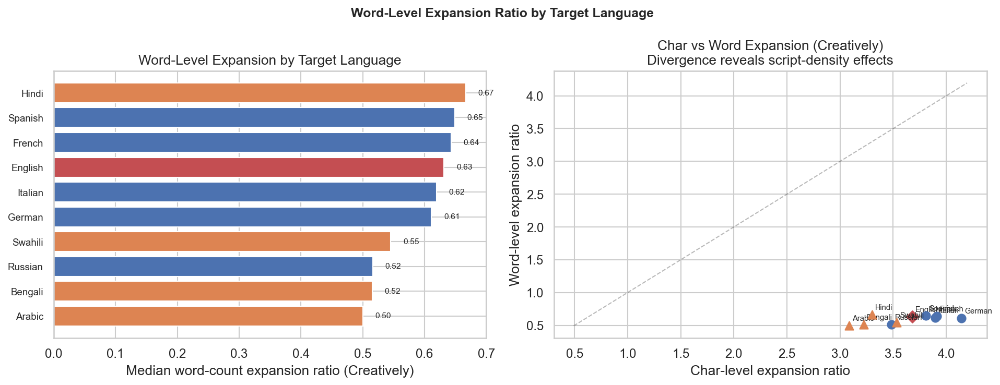
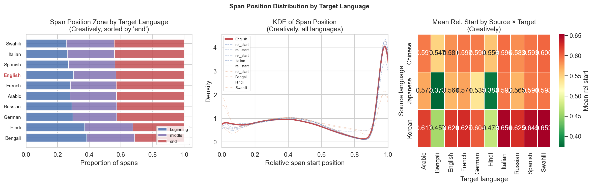
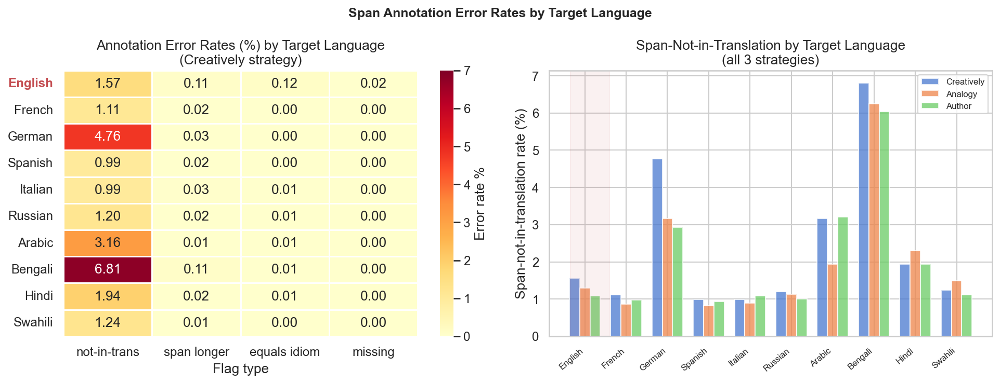
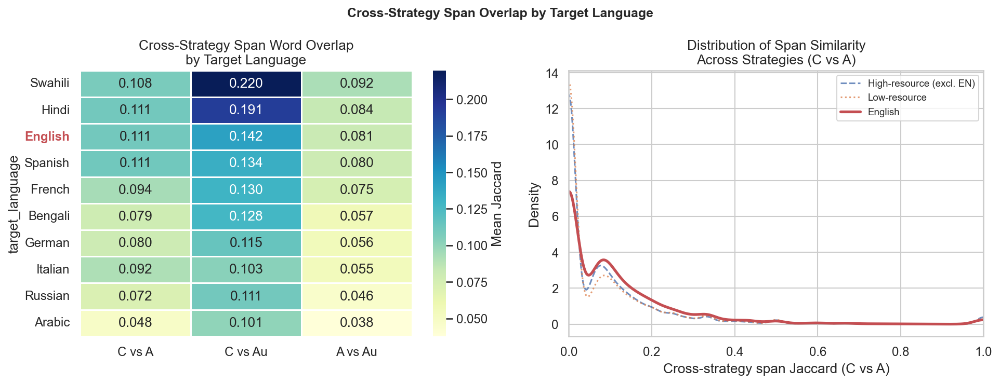
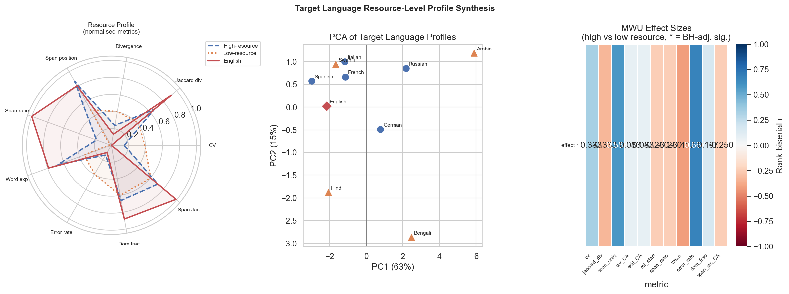

# IdiomTranslate30 — Basic Statistics Report

*Generated on 2026-03-22*

> **Disclaimer:** This report was automatically generated by [Claude Code](https://claude.ai/claude-code).
> Numerical results are derived from scripts run against the raw data, but interpretations,
> summaries, and prose descriptions may contain errors or hallucinations. Verify critical
> findings against the source scripts and data before citing.

---

## Overview

**IdiomTranslate30** is a massively multilingual dataset of context-aware translations of East Asian
idioms across 30 language pairs, generated using Google Gemini 3.0 Flash Preview. It extends the
translation methodology introduced in *Tang et al. (2024), "Creative and Context-Aware Translation
of East Asian Idioms with GPT-4"* (Findings of EMNLP 2024, pp. 9285–9305), scaling from a single
language pair to 30 language pairs and switching the backbone model from GPT-4 to Gemini 3.0.

The name **IdiomTranslate30** is doubly meaningful: 30 language pairs (3 source × 10 target), and
30 parallel translations per (idiom, target language) — 10 context sentences each translated under
3 strategies (Creatively, Analogy, Author), giving 30 translations per cell.

Each row in the dataset corresponds to one (source idiom, target language, context sentence) triple
and contains **3 translations** (one per strategy) plus 3 span annotations, for a total of
**2,719,800 individual translations** (906,600 rows × 3 strategies).

The 906,600 rows are derived as follows:

| Source | Idioms | × Target langs | × Sentences | = Rows |
|---|---|---|---|---|
| Chinese | 4,306 | 10 | 10 (20 for 4 idioms) | 431,000 |
| Japanese | 2,440 | 10 | 10 | 244,000 |
| Korean | 2,316 | 10 | 10 | 231,600 |
| **Total** | **9,062** | | | **906,600** |

> **Unintentional dictionary duplicates — two types:**
>
> **(1) 113 ZH–JA shared idiom strings.** The per-source totals sum to **9,062**, but the
> dataset-wide unique count is **8,949** because 113 classical Chinese idiom strings (e.g.
> 一丘之貉, 一刻千金, 一字千金) appear identically as both a Chinese entry and a Japanese
> yojijukugo entry. These are unintentional duplicates caused by the same string being present
> in both the Chinese and Japanese source dictionaries. All 113 appear as "exact_4/4" pairs in
> the ZH–JA cognate table (see Extended Cognate Analysis below), accounting for 113 of the 266 reported exact matches;
> the remaining 153 are genuine cognates with different raw forms (e.g. simplified ZH 精明强干
> vs Japanese 精明強幹) that match only after s2t normalisation.
>
> **(2) 4 Chinese idioms entered twice in the source dictionary.** 前仆后继, 固执己见,
> 生龙活虎, and 触景生情 each triggered two independent sentence-generation prompt runs instead
> of one, producing 20 sentences per target language rather than 10. Inspection confirms the
> two runs are stored as consecutive blocks of 10: sentences 1–10 and 11–20 are generated
> independently from the same prompt, and do overlap — for 触景生情, sentences 11–13 are exact
> duplicates of sentences 1–3. This adds 4 × 10 × 10 = 400 extra rows, explaining why
> 4,306 × 10 × 10 = 430,600 ≠ 431,000.

| Property | Value |
|---|---|
| Total rows | 906,600 |
| Total translations | 2,719,800 (906,600 × 3 strategies) |
| Columns | 10 |
| Source languages | 3 (Chinese, Japanese, Korean) |
| Target languages | 10 |
| Language pairs | 30 (3 × 10) |
| Context sentences per (idiom, target language) | 10 |
| Translation strategies per sentence | 3 (Creatively, Analogy, Author) |
| Unique idioms | 8,949 |
| Missing span annotations | 62 |
| License | CC-BY-NC-SA-4.0 |

---

## Language Distribution

### Source Languages

| Language | Rows | Share |
|---|---|---|
| Chinese | 431,000 | 47.5% |
| Japanese | 244,000 | 26.9% |
| Korean | 231,600 | 25.5% |

### Target Languages

| Language | Rows | Share |
|---|---|---|
| Arabic | 90,660 | 10.0% |
| Bengali | 90,660 | 10.0% |
| English | 90,660 | 10.0% |
| French | 90,660 | 10.0% |
| German | 90,660 | 10.0% |
| Hindi | 90,660 | 10.0% |
| Italian | 90,660 | 10.0% |
| Russian | 90,660 | 10.0% |
| Spanish | 90,660 | 10.0% |
| Swahili | 90,660 | 10.0% |

Each of the 10 target languages is perfectly balanced (~90,660 rows, 10.0%).
Each of the 30 language pairs contains a fixed number of rows proportional to the source language's
idiom inventory size (Chinese: 43,100 / pair; Japanese: 24,400 / pair; Korean: 23,160 / pair).

---

## Idiom Coverage

| Source Language | Unique Idioms |
|---|---|
| Chinese | 4,306 |
| Japanese | 2,440 |
| Korean | 2,316 |
| **Total** | **8,949** |

Most idioms appear **100 times** in the dataset (10 target languages × 10 context sentences).
Four Chinese idioms appear 200 times (see [Data Edge Cases](#data-edge-cases)).

---

## Translation Length Statistics

Character-level length statistics for the three translation strategies:

| Strategy | Min | Median | Mean | Max |
|---|---|---|---|---|
| Creatively | 16 | 97 | 100 | 9472 |
| Analogy | 15 | 121 | 124 | 11821 |
| Author | 17 | 118 | 123 | 3034 |

Key observations:
- **Analogy** and **Author** strategies produce longer translations than **Creatively** (median ~121 vs 97 chars).
- All strategies have heavy-tailed distributions — the maximum lengths are 3–12× the median,
  indicating occasional verbose outputs.
- No translation is shorter than 15 characters (no empty outputs).

---

## Source Sentence Lengths

Source sentences are short by design (they carry exactly one idiom):

| Statistic | Value |
|---|---|
| Min | 0 chars |
| Median | 27 chars |
| Mean | 27.9 chars |
| Max | 108 chars |

---

## Missing Values

| Column | Missing |
|---|---|
| span_creatively | 19 |
| span_analogy | 19 |
| span_author | 24 |
| All others | 0 |

Missingness is negligible (<0.003% of rows) and only affects span annotation columns.

---

## Zero-Length Source Sentences

Three idioms account for all 300 zero-length source sentences (100 rows each, covering all 10
target languages × 10 sentence slots):

| Idiom | Language | Root cause |
|---|---|---|
| 强奸民意 | Chinese | Content policy refusal |
| 推荐让能 | Chinese | Extremely obscure classical idiom |
| 공휴일궤 | Korean | Extremely rare classical idiom |

**强奸民意** (qiángjian mínyì, "to violate the public will") contains 强奸 (qiángjian = rape).
The sentence generation pipeline almost certainly refused to produce Chinese context sentences
containing this character sequence, leaving the sentence field empty for all 100 rows.

**推荐让能** (tuījiàn ràng néng, "recommend the worthy, yield to the capable") is an extremely
rare classical Chinese idiom. The model could not generate plausible context sentences for it.

**공휴일궤** is the Korean (Hangul) form of the Sino-Korean idiom 功虧一簣 (lit. "one basket of
earth short of completing the mound" → "to fail at the very last step"). Its Chinese counterpart
**功亏一篑** is present in the dataset and has normal sentence coverage; only the Korean rendering
was affected, suggesting the Korean sentence generator did not recognise this archaic form.

### Failure patterns in the translations

Because the sentence field is empty but translations were still generated, these 300 rows exhibit
four distinct model failure modes:

**1. Prompt leak (Creatively strategy only, 14–30% of rows per idiom)**

The `translate_creatively` field contains the raw translation prompt instead of a translation.
Examples:
- Swahili: *"Tafadhali tafsiri sentensi ifuatayo kutoka Kikorea kwenda Kiswahili kwa ubunifu:"*
  ("Please translate the following sentence from Korean to Swahili creatively:")
- Spanish: *"Por favor, traduce la siguiente oración del coreano al español de forma creativa"*
- Bengali: contains the request for the Chinese sentence to be provided

Prompt leaks occur **exclusively in the Creatively strategy** and are concentrated in Bengali and
Swahili (6–10/10 rows). English, French, German, Italian, and Russian show zero leaks, likely
because these languages' instruction-following prompts are structured differently by the pipeline.

**2. Literary hallucination (Author strategy, model defaults to famous openings)**

Without a source sentence, the Author strategy — prompted to write in the style of a famous
author in the target language — anchors on the most salient literary text in its training data:

| Target | Recurring hallucination | Source |
|---|---|---|
| Spanish | *"En un lugar de la Mancha, de cuyo nombre no quiero acordarme…"* (6–7× per idiom) | Don Quixote |
| Russian | *"Все счастливые семьи похожи друг на друга…"* (8× for 공휴일궤) | Anna Karenina |
| French | *"L'abîme appelle l'abîme"* / *"Hélas ! quel sombre abîme…"* | Victor Hugo |
| Italian | *"Quel ramo del lago di Como…"* | I Promessi Sposi |
| English | *"Stay thy course, and harken to my plea"* (Shakespearean pastiche) | — |

This is a classic **mode collapse to salient training data** when the conditioning signal (source
sentence) is absent. The two Chinese idioms share 9 identical Author-strategy translations,
confirming these are pure fallback outputs unrelated to the idiom.

**3. Poetic hallucination (Analogy strategy)**

The Analogy strategy generates elaborate unrelated metaphors in the target language (e.g. Arabic
*"أنتِ كالبحر في عمق أسراره"* — "You are like the sea in the depths of its secrets"). Outputs
are almost entirely unique (99/100 per idiom), confirming unconstrained generation.

**4. Meta-response spans**

A large fraction of span annotations for these rows contain the model's own explanation of the
mismatch rather than an actual span:
- 强奸民意: 72–88% meta-response spans depending on strategy (highest of the three)
- 推荐让能: 39–64% meta-response spans
- 공휴일궤: 7–16% meta-response spans

Example (span_creatively for 공휴일궤, English): *"The Korean idiom 공휴일궤 (功虧一簣) means
'to fail at the last step'… However, looking at your provided Arabic translation… there is no
span that corresponds to the idiom."*

强奸民意 produces the most meta-responses because the model also recognises — even when it does
generate a translation — that the content is inconsistent with the sensitive idiom, making it
refuse to extract a span in the majority of cases.

### Impact on downstream analyses

These 300 rows (0.033% of the dataset) have undefined expansion ratios (division by zero) and
completely uninformative translations. The difficulty composite correctly identifies
强奸民意 (difficulty 0.901) and 推荐让能 (difficulty 0.842) as the two hardest Chinese idioms —
their high scores are driven entirely by the pathological variance in these failed translations,
not by genuine idiom difficulty. These three idioms should be **excluded from any analysis
that relies on sentence content or translation fidelity**.

---

## Data Edge Cases

### Idioms with 20 Sentences per Target Language

The dataset is nominally structured as 10 context sentences per (idiom, target language). However,
4 Chinese idioms appear with **20 sentences** per target language (200 rows per
idiom instead of the standard 100):

| Idiom | Language | Sentences per target |
|---|---|---|
| 前仆后继 | Chinese | 20 |
| 固执己见 | Chinese | 20 |
| 生龙活虎 | Chinese | 20 |
| 触景生情 | Chinese | 20 |

These idioms contain mostly unique sentences — within-group sentence-level duplicates exist for
固执己见 (1 dup) and 触景生情 (3 dups) across some target languages.
All analysis scripts handle variable group sizes correctly by taking means across all available
sentences before aggregation.

---

## Pre-processing

### Extremely Long Translations

A small number of translations are pathologically long, caused by model generation failures.
The threshold for exclusion is **500 characters**, which lies far above the p99.99
of each strategy (Creatively: 263 chars, Analogy: 302 chars, Author: 348 chars).

**Rows removed:** 1 Creatively, 1 Analogy, 3 Author
(total 5 (row, strategy) pairs out of 906,600 rows; < 0.001%)

| Strategy | Idiom | Source | Target | Length |
|---|---|---|---|---|
| Creatively | 이율배반 | Korean | Arabic | 9,472 |
| Analogy | 風前之灯 | Japanese | Swahili | 11,821 |
| Author | 向隅而泣 | Chinese | Bengali | 572 |
| Author | 癞蛤蟆想吃天鹅肉 | Chinese | Hindi | 3,034 |
| Author | 不求甚解 | Chinese | Swahili | 1,109 |

**Failure patterns identified:**

1. **Token repetition loop** — the model begins a normal sentence and then degenerates into
   repeating a single token thousands of times before (sometimes) recovering at the very end.
   - *이율배반* (KO→Arabic, Creatively, 9,472 chars): the Korean word 불신 (distrust) repeated
     ~2,613 times mid-sentence after a normal Arabic opening.
   - *風前之灯* (JA→Swahili, Analogy, 11,821 chars): the letter "k" repeated ~5,852 times
     immediately after the first clause; the sentence resumes at the very end.

2. **Meta-response leak** — the model includes its own instruction-following framing in the output
   instead of just the translation.
   - *不求甚解* (ZH→Swahili, Author, 1,109 chars): output begins with a biography of the Swahili
     author Shaaban Robert, followed by "Hapa kuna tafsiri ya sentensi yako…" ("Here is a
     translation of your sentence…") and ends with "Je, ungependa nijaribu kutafsiri sentensi
     nyingine yoyote?" ("Would you like me to try translating any other sentence?").

3. **Runaway generation** — the model's output is semantically coherent but never converges,
   piling on additional content.
   - *向隅而泣* (ZH→Bengali, Author, 572 chars): the protagonist's name changes five times
     within a single sentence (হিমু → লিটন → শামীম → শফিক → টোকন → খোকন), suggesting the
     model could not commit and kept revising in-place.
   - *癞蛤蟆想吃天鹅肉* (ZH→Hindi, Author, 3,034 chars): the translation chains together an
     ever-growing list of Hindi proverbs (अंधा क्या चाहे, लात के देवता, धोबी का कुत्ता…)
     without settling on a single rendering.

These 5 (row, strategy) pairs represent < 0.001% of the data; their removal does not
materially affect any reported statistic. They are excluded from any translation-length
visualisations that cap the axis range.

---

## Figures

### 1. Fig1 Language Distribution

Distribution of rows across source (left) and target (right) languages. Target languages are perfectly balanced (~90,660 rows each), while Chinese contributes nearly half the source sentences.

### 2. Fig2 Idiom Coverage

Number of unique idioms per source language. Chinese has the largest inventory (4,306), followed by Japanese (2,440) and Korean (2,316).

### 3. Fig3 Translation Length Violin

Violin plot of translation lengths (characters) for each strategy on a 50k-row sample. Inner lines show quartiles. Analogy and Author strategies tend to produce longer translations than the Creatively strategy.

### 4. Fig4 Length By Target Language

Median character count of each translation strategy grouped by target language. Languages with complex scripts (e.g., Arabic, Bengali, Hindi) tend to have shorter character counts despite equivalent semantic content.

### 5. Fig5 Sentence Length By Source

Density histogram of source sentence lengths by language. All three languages show a similar unimodal distribution peaking around 25–30 characters, consistent with the dataset's design of short, idiom-carrying sentences.

### 6. Fig6 Span Length By Strategy

Box plots of the character length of the idiom span identified within each translation. The Analogy strategy produces noticeably longer spans, suggesting more elaborate idiomatic substitutions.

### 7. Fig7 Missing Spans

Count of missing span annotations per source language and strategy. Missingness is very low overall (<25 rows) and concentrated in Chinese rows.

## Analysis Results

Results from running analysis scripts on the full dataset (906,600 rows).
See [TODO.md](TODO.md) for future work.

### Table of Contents

| Part | Topic |
|---|---|
| [1. Data Quality](#part-1-data-quality) | Annotation reliability before any analysis |
| [2. Idiom Coverage](#part-2-idiom-coverage) | Which idioms are in IT30 and how well-known are they |
| [3. Translation Behaviour](#part-3-translation-behaviour) | How the model translates: length, structure, diversity, context |
| [4. Cross-Lingual Patterns](#part-4-cross-lingual-patterns) | How target language choice shapes output |
| [5. Cross-Source Cognate Analysis](#part-5-cross-source-cognate-analysis) | Same idiom translated from different source languages |
| [6. Synthesis](#part-6-synthesis) | Composite difficulty score integrating all findings |
| [7. Target-Language Profiles](#part-7-target-language-profiles--english-and-resource-level-patterns) | English fingerprint and high- vs low-resource target language patterns |
| [8. Reverse Span Analysis](#part-8-reverse-span-analysis--translation-attractors) | Spans that absorb many idioms; most overloaded translation phrases per language |
| [9. Analogy Strategy Slop Patterns](#part-9-analogy-strategy-slop-patterns) | Recurring metaphor templates and model-specific clichés in the Analogy strategy |

---

## Part 1: Data Quality

Before examining translation content, we characterise annotation quality. Each row contains
model-generated span annotations marking where the idiom rendering appears in the translation.
These are the primary quality concern since they are not human-verified.

### Span Annotation Audit

| Check | Creatively | Analogy | Author |
|---|---|---|---|
| Missing span | 19 (0.002%) | 19 (0.002%) | 24 (0.003%) |
| Span not contained in translation | 21,549 (2.38%) | 18,258 (2.01%) | 18,421 (2.03%) |
| Span longer than translation | 329 | 420 | 271 |
| Span equals raw idiom | 155 | 188 | 124 |
| Degenerate translation (= source) | 0 | 0 | 1 |

**5.80% of rows (52,608) carry at least one flag**, almost entirely driven by span-not-in-translation
cases (~2% per strategy). A filtered version can be produced from `data/audit/anomalies.csv`.
The 2% rate motivates a closer look at what these cases actually represent.

### Span Error Classification

Breakdown of the ~58k flagged rows:

| Category | Creatively | Analogy | Author |
|---|---|---|---|
| Partial word overlap | 16,495 | 14,618 | 14,138 |
| Off-by-one boundary | 1,731 | 1,320 | 1,477 |
| No overlap | 1,613 | 1,009 | 1,363 |
| Case mismatch | 1,267 | 981 | 1,064 |
| Punctuation difference | 435 | 326 | 363 |
| Leading/trailing whitespace | 8 | 4 | 16 |

**~77% are partial word overlap** — the span shares at least one word with the translation but
is not a contiguous substring, most likely because the model paraphrased the idiom across
non-adjacent words. These are annotation artefacts safe to retain for most analyses. The ~7%
"no overlap" cases (≈3,985 flagged pairs across three strategies) are the only ones that warrant
filtering for span-dependent tasks. All analyses below treat flagged rows as-is unless otherwise noted.

---

## Part 2: Idiom Coverage

This part characterises *which* idioms are in IT30 — their structural properties, how they
relate to existing idiom dictionaries, and what categories are intentionally or unintentionally
excluded.

### Idiom Morphology & Structure

| Source language | % 4-character idioms |
|---|---|
| Japanese | 100% |
| Korean | 100% |
| Chinese | 91.4% |

All Japanese and Korean idioms are exactly 4 characters (pure yojijukugo / saseong-eoro).
Chinese has an 8.6% tail of non-4-char chengyu. Structurally, IT30 therefore covers a very
homogeneous slice of each language's idiom space — the "classical four-character" register —
which matters for how we interpret external coverage comparisons below.

Non-4-char Chinese idioms attract slightly higher expansion ratios (4-char: 3.65× vs 7+: 4.33×
for Creatively), suggesting that longer surface forms carry more explicable content. Sentence
length also predicts translation length (Spearman ρ = 0.47–0.67 across source languages and
strategies), confirming that richer context propagates into more verbose translations.

### Overlap with External Idiom Sources

Given the structural uniformity above, we test how well IT30's idiom inventory aligns with
established dictionaries.

**Chinese — chinese-xinhua (31k chengyu):**
- 4,117 / 4,306 IdiomTranslate30 Chinese idioms found in xinhua (**95.6% coverage**)
- 189 unmatched idioms are predominantly non-4-character (only 61.4% are 4-char vs 92.8% for matched)
- 86.7% of xinhua is not in IdiomTranslate30, showing significant room for extension

**Chinese — THUOCL corpus frequencies (8,519 chengyu):**
- 3,441 / 4,306 matched (**79.9% coverage**)
- THUOCL-matched idioms produce *shorter* translations than unmatched ones (Creatively:
  102.6 vs 113.7 chars, p ≈ 0), suggesting rarer chengyu require more elaborate explanation
- Frequency quintile effect on expansion ratio is weak (Spearman ρ ≈ −0.04 to +0.07)

**Chinese — xinhua definition length:**
- Weak positive correlation between definition length and translation length
  (ρ ≈ 0.06–0.13), confirming that semantically richer idioms tend to produce longer translations

**Korean — psyche/korean_idioms (sokdam proverbs):**
- **0% overlap** — confirmed correct. IT30 Korean idioms are exclusively 4-character Hangul
  saseong-eoro (사자성어); psyche/korean_idioms contains multi-word sentence-form sokdam (속담)
  proverbs averaging 10–14 characters. These are categorically distinct idiom types.

### Unmatched Chinese Idioms

A closer look at the 189 Chinese idioms (4.4%) absent
from chinese-xinhua:

- 116 are 4-char, 22 are 7-char, 23 are 9-char.
- **41 / 189 contain non-CJK characters** (commas, spaces) — multi-clause proverbs mistakenly
  included as chengyu (e.g. "前车之覆，后车之鉴", "说曹操，曹操就到").
- The remaining 148 all-CJK unmatched idioms are likely valid but obscure chengyu absent from
  xinhua's 31k corpus.
- Unmatched idioms produce slightly longer translations (Creatively: 112.7 vs 104.4 chars),
  consistent with the THUOCL finding that rarer idioms require more explanation.

### Japanese Yojijukugo: External Coverage

Reference list built from the kaikki.org English
Wiktionary Japanese dump (360 MB):

- **3,579 unique 4-char CJK entries** extracted; 317 explicitly tagged as 四字熟語/yojijukugo.
- IT30 Japanese ∩ Wiktionary reference: **435 / 2,440 (17.8%)**.
- 2,005 IT30 Japanese idioms (82.2%) are absent from Wiktionary, suggesting IT30 covers many
  obscure or classical yojijukugo not in the English Wiktionary — a stronger skew toward
  rarity than seen for Chinese (4.4% unmatched) or Korean.
- Note: Wiktionary coverage is incomplete; a dedicated 四字熟語辞典 would give a better baseline.

### Complementary Idiom Types

IT30 covers one specific register per language.
To understand what is *excluded*, three structurally different idiom types were characterised:

- **Korean 속담** (`psyche/korean_idioms`): 7,984 sentence-form proverbs, median 14 chars,
  avg 4.7 words. Structurally distinct from saseong-eoro — the 0% string overlap confirms
  these are categorically separate, not just a different slice of the same inventory.
- **Japanese ことわざ** (`sepTN/kotowaza`): 70 entries only (median 7 chars). Rich annotations
  but too small for statistical analysis; a larger kotowaza source remains outstanding.
- **Chinese 歇后语** (`chinese-xinhua/xiehouyu.json`): 14,032 two-part riddle-sayings, median
  6-char riddle portion. Zero overlap with IT30 by design — their riddle-punchline structure
  is incompatible with the single-sentence context format used in IT30.
- Japanese 慣用句 (kan'youku): no freely available dataset found.

The takeaway: IT30 is not a general idiom dataset but a highly specific one — the "classical
four-character" genre of each East Asian language — which should be kept in mind when
generalising findings.

---

## Part 3: Translation Behaviour

With the idiom inventory characterised, we now examine how Gemini 3.0 translates it. The
analyses below ask: how long are translations, what fraction of them carries the idiom
rendering, where in the sentence does the rendering appear, how different are the three
strategies from each other, how lexically varied is the output, and does context actually
change translations or are they largely templated?

### Translation Length & Expansion Ratio

Translations are substantially longer than their source sentences across all strategies:

| Strategy | Median expansion ratio | Mean | Macro-mean (over idioms) |
|---|---|---|---|
| Creatively | 3.59× | 3.68× | 3.68× |
| Analogy | 4.46× | 4.60× | 4.60× |
| Author | 4.36× | 4.55× | 4.55× |

Wilcoxon signed-rank tests (one-sided, Creatively < Analogy/Author) are significant at p < 10⁻³⁰⁰
for every target language. Effect sizes (rank-biserial correlation r = 1 − 2T / (n(n+1)/2))
range 0.55–0.97, largest for Spanish and Russian in the Author strategy. The large expansion
ratios reflect the fundamental challenge of idiom translation: the target must convey figurative
meaning that the source sentence implies rather than states, requiring elaboration.

The contrast is sharpest when comparing idioms that map directly onto an English phrase versus
those that encode a culturally specific concept with no ready equivalent. The Chinese 一言以蔽之
("to cover it with one word") expands only 2.6× because Creatively can collapse the entire idiom
into "In a word" or "All things considered" — the English phrase *is* the idiom. By contrast,
偃武修文 ("lay down arms, cultivate letters") expands 6.3× because no English shorthand exists:
the model must construct a phrase like "laid down its swords to cultivate the arts of peace."
The same pattern holds across source languages. Japanese 金科玉条 ("golden rules worth cherishing")
yields a compact rendering — "the gospel for our team" (Creatively), "a most sacred canon"
(Author) — while the filial gratitude idiom 寸草春暉 ("a blade of grass cannot repay spring's
warmth") requires a full simile in every strategy: "a debt as vast as the sky is to a blade of
grass." Korean 회자인구 ("on everyone's lips") collapses to "the talk of the town," whereas
남귤북지 ("citrus becomes trifoliate north of the Huai River," i.e. context shapes character)
must be unpacked as "how a change in setting can turn a common shrub into a bearer of golden
fruit" — a full explanatory clause.

### Span Length & Idiom Footprint

These long translations are not uniformly padded. The idiom span — the model's rendering of
the idiom itself — occupies only a modest fraction of each translation:

| Strategy | Median span/translation ratio |
|---|---|
| Creatively | 0.274 |
| Author | 0.271 |
| Analogy | 0.362 |

Analogy produces substantially longer spans relative to the translation (0.36 vs 0.27),
consistent with its design as an analogy-based strategy that elaborates the idiomatic
substitution. Cross-strategy span length correlations are **low** (Pearson r ≈ 0.22–0.29),
indicating that the three strategies render the idiom in very different surface forms even
when overall translation lengths are similar.

### Span Position Within Translation

Beyond size, the *position* of the span within the translation reveals how sentences are
structured around the idiom rendering. Relative start position is computed as
`start_offset / (translation_len − span_len)`, where 0 = span at the very start, 1 = at the
very end. Rows where the span is not found as a substring (~2% per strategy) are excluded.

| Strategy | Beginning (0–⅓) | Middle (⅓–⅔) | End (⅔–1) |
|---|---|---|---|
| Creatively | 29.9% | 29.1% | 41.0% |
| Analogy | 29.6% | 26.0% | 44.5% |
| Author | 30.2% | 29.6% | 40.3% |

Across all strategies the idiom span **skews toward the end** (~40–45% vs ~30% each for
beginning and middle). This suggests the model tends to introduce context and build up to
the idiomatic expression rather than leading with it — a rhetorical pattern consistent with
how idiomatic expressions function as conclusions or punchlines in natural discourse.

South Asian languages (Bengali 0.478, Hindi 0.488) place the span earliest; Romance and Bantu
languages place it latest (Italian 0.609, Swahili 0.612), reflecting word-order differences
across target languages. Chinese and Korean sources produce later-positioned spans (~0.59)
than Japanese (~0.54).

In English, the difference is particularly stark with grammatical-particle idioms versus
narrative-conclusion idioms. The Chinese 总而言之 ("in summary") and Japanese 如是我聞
("thus have I heard," a Buddhist formula for reported speech) and Korean 십상팔구
("eight or nine out of ten") all function as sentence-initial adverbials, so the span
*must* appear first: "When all is said and done, this plan stands as our premier path
forward" / "Thus have I heard: the Master shall venture across the seas" / "Nine times
out of ten, I have no one to blame but myself." By contrast, idioms used as final
appraisals — Chinese 亡羊得牛 ("lose a sheep, gain an ox"), Japanese 塗炭之苦
("suffering in mud and charcoal"), Korean 함흥차사 ("a messenger sent to Hamhung who
never returns") — consistently appear at or near the sentence end: "losing a sheep
ultimately gained him an ox" / "cast into a living hell of misery and despair" /
"talk about a total swing and a miss." The span-position signal therefore partly reflects
syntactic function rather than a free stylistic choice by the model.

### Strategy Divergence

The three strategies not only produce different span sizes and positions — their full
translations are substantially different from each other:

| Pair | Mean unigram divergence | Mean normalised edit distance |
|---|---|---|
| Creatively → Analogy | 0.604 | 0.574 |
| Creatively → Author | 0.673 | 0.607 |
| Analogy → Author | 0.758 | 0.653 |

Analogy and Author diverge from each other *more* than either diverges from Creatively,
suggesting Creatively occupies a middle ground. Divergence is highest for culturally specific
idioms with no clear English equivalent and lowest for idioms with a ready conventional
rendering — the model's three strategies converge when the answer is obvious and diverge
when interpretation is required.

The clearest illustrations come from the low-divergence end. Chinese 非驴非马 ("neither
donkey nor horse," i.e. nondescript hybrid) maps immediately onto the English "neither X
nor Y" template, so all three strategies stay within that frame: "neither fish nor fowl" /
"neither fish nor feather" / "neither ass nor horse." Japanese 広大無辺 ("vast and
boundless beyond measure") is similarly transparent, and every strategy renders it with
near-identical wording: "vast and boundless" / "so boundless" / "vast and boundless
reach." At the high-divergence end, the Japanese 口耳四寸 ("the distance between ear and
mouth," meaning superficial learning retained only briefly) produces three radically
different metaphors: "flew from lip to ear before the breath could even cool" (Creatively),
"within the span of a single heartbeat's echo" (Analogy), "hath o'erleapt the space
'twixt mouth and ear" (Author) — each strategy reaches for a different image because no
English phrase captures the spatial metaphor of the original. Korean 회계지치 ("returning
home exhausted") similarly fragments: "completely bone-tired" (Creatively, 2 words), "as
though my internal battery had been replaced with a handful of cold, wet sand" (Analogy,
a sprawling 20-word metaphor), "a most profound weariness of the spirit" (Author) —
the strategies agree on the meaning but disagree on everything else.

### Lexical Diversity

Strategy divergence is also reflected at the vocabulary level. **Type-token ratios** of
individual translations are very high (median ≈ 1.00 for Creatively, 0.957 for Analogy and
Author), meaning individual translations are short enough that almost every word is unique.
More informative is the span-level lexical breadth across all 10 target languages per idiom:

| Strategy | Mean unique unigrams in spans per idiom |
|---|---|
| Creatively | 280.5 |
| Author | 346.8 |
| Analogy | 512.9 |

Analogy produces nearly twice as many distinct span renderings as Creatively, confirming
it is the most lexically inventive strategy. This is consistent with the strategy divergence
results above: Analogy diverges most from the other strategies and also generates the widest
span vocabulary. Span TTR correlates weakly but positively with full-translation TTR (ρ ≈ 0.15–0.25).

### Context Sensitivity & Span Reuse

The analysis so far treats each row independently. But each (idiom, target language) cell
contains 10 sentences — how much do translations *within* that cell vary? High within-cell
variation means the model genuinely reads and uses context; low variation means it effectively
ignores it and applies a fixed rendering.

**Translation length variation (CV across 10 sentences):**

| Strategy | Mean CV | Median CV | CV > 0.10 |
|---|---|---|---|
| Creatively | 0.206 | 0.201 | 98.7% |
| Analogy | 0.195 | 0.190 | 98.3% |
| Author | 0.219 | 0.213 | 99.0% |

98–99% of cells show non-trivial length variation — **the model is consistently context-sensitive**.
Author is most sensitive (CV 0.219) and Analogy least (0.195), which mirrors their between-strategy
divergence ordering. Word-level diversity within cells confirms the same picture: mean pairwise
Jaccard between the 10 translations within a cell is ~0.08 — any two translations share about
8% of their combined vocabulary, confirming genuine lexical variation across sentences.

**Span reuse across the 10 sentences:**

| Strategy | All-different spans (10 unique) |
|---|---|
| Creatively | 62.3% |
| Analogy | 92.1% |
| Author | 76.4% |

Spans are overwhelmingly **sentence-driven, not idiom-driven**: in 62–92% of cells, every
sentence produces a distinct span. Analogy's 92% fully-unique rate is the flip side of its
high lexical diversity (see Lexical Diversity above) — it not only produces different vocabulary
across target languages but also across sentences for the same target language. No cell achieves full
convergence to a single fixed span, ruling out simple template-based annotation.

The span-reuse examples make this concrete. Analogy spans for Chinese 知过必改 ("know a
fault, correct it") across 10 English sentences span a wide range of distinct metaphors:
"treat his flaws like cracks in a dam," "prune his past actions like a gardener," "treat
their mistakes like software bugs to be patched on sight" — every sentence prompts a fresh
analogy. The same pattern holds for Japanese 南船北馬 ("south by boat, north by horse,"
i.e. constant travel): "dandelion seed chasing the four winds," "the restless wind and the
tireless tide," "weaving his career across the map like a migratory needle stitching
horizons together" — ten sentences, ten metaphors, none repeated. Korean 옥하가옥 ("jade
below jade," i.e. excellence upon excellence) produces equally inventive variation:
"sapphire eye watching over a kingdom of emeralds," "a lighthouse built atop a sun,"
"gilding a dragonfly's wings." By contrast, idioms that already have a fixed conventional
English rendering lock in: Chinese 瓮中捉鳖 ("catching a turtle in a jar") produces
"shooting fish in a barrel" for all 10 sentences without variation; Japanese 試行錯誤
yields "trial and error" nine times out of ten; Korean 죽림칠현 (the "Seven Sages of the
Bamboo Grove") always renders as that exact proper noun. The distinction is between idioms
that carry a vivid concrete image (inviting fresh analogies) and those that map directly to
an established English phrase (forcing convergence regardless of context).

Context sensitivity varies across idioms in related ways. Chinese 千篇一律 ("a thousand
pieces of identical prose," i.e. monotonous uniformity) produces three nearly identical
English Creatively translations: "stuck in a rut," "cut from the same cloth," "cut from
the exact same cloth" — the idiom's meaning is so directly expressed by a fixed English
idiom that context barely matters. Chinese 罪魁祸首 ("chief culprit"), by contrast, ranges
from a terse "He is the rotten heart of this corruption case" (3 words for the idiom
itself) to "Everyone knows exactly whose hands are dirty in today's chaos" (no explicit
idiom phrase at all) to a full clause about scapegoating in a financial crisis — the word
"culprit" can take on very different emphases depending on domain and subject matter.
Similarly, Japanese 問答無用 ("no questions permitted") ranges from "My word is final"
(sentence-initial imperative context) to "They were forced into blind obedience, expected
to follow the rules without question or recourse" (narrative third-person context) — the
same idiom serves as either a blunt command or an elaborate explanation of authority. The
Korean 경성지미, an obscure idiom, shows the highest context sensitivity of all, but for
a different reason: lacking a stable meaning, the model latches onto different
interpretations across sentences — "refined elegance," "the flavors of Gyeongseong,"
"the grit to grind a mirror from a stone" — illustrating how ambiguous or rare idioms
induce not genuine context-sensitivity but semantic instability.

---

## Part 4: Cross-Lingual Patterns

Having characterised how the model translates a given idiom into a given language, we now ask
how much the *choice* of target language matters — and whether language family membership
explains shared vocabulary across translations of the same idiom.

### Cross-Lingual Consistency

The coefficient of variation (CV) of translation length *across* the 10 target languages per
idiom, computed on per-language means (aggregated over the 10 context sentences first):

| Strategy | Mean CV |
|---|---|
| Creatively | 0.108 |
| Analogy | 0.115 |
| Author | 0.165 |

Author shows substantially higher cross-lingual inconsistency (CV 0.165) than the other
two strategies, suggesting its stylistic framing is more sensitive to which target language
is used. This is driven largely by a resource gap: high-resource target languages (English,
French, German, Spanish, Italian, Russian) produce significantly longer translations than
low-resource ones (Arabic, Bengali, Hindi, Swahili), with the gap largest for Author
(~30 chars mean difference, Mann-Whitney p ≈ 0).

> **Note (bug fix):** an earlier version computed CV over raw rows, conflating within-language
> sentence variance with between-language variance, inflating CV by 63–110%. The values
> above are corrected.

### Cross-Target Language Word Overlap

The cross-lingual consistency analysis shows that translation *length* varies across target languages. We now ask whether *vocabulary* is shared across languages for the same idiom — specifically whether language family predicts shared words.

For each (idiom, strategy), the vocabulary across all 10 sentences is aggregated per target
language (word-set union), then pairwise Jaccard is computed across all 45 language pairs.
Pairs are classified as within-family or between-family.

| Strategy | Within-family Jaccard | Between-family Jaccard |
|---|---|---|
| Creatively | 0.021 | 0.002 |
| Analogy | 0.019 | 0.001 |
| Author | 0.017 | 0.001 |

Within-family overlap is **14–19× higher** than between-family overlap. Between-family Jaccard
has a median of exactly 0.000, confirming near-complete absence of shared vocabulary across
unrelated language families in idiom translations. The Romance triad dominates within-family
overlap: Spanish–Italian (0.041) > French–Spanish (0.033) > French–Italian (0.022). Germanic
pairs score lower (English–German 0.010), reflecting English's greater lexical divergence from
German. Critically, the source language (Chinese, Japanese, Korean) has no detectable effect
on the pattern — cross-target overlap is entirely a property of the target languages.

---

## Part 5: Cross-Source Cognate Analysis

Parts 3 and 4 treat each source language independently. A more nuanced question is: when the
*same underlying idiom* appears in multiple source languages (as Sino-Korean and Sino-Japanese
cognates), do translations converge or remain divergent? This tests whether source language
context — the surrounding prose, the script, the cultural framing — shapes the translation
independently of the idiom's meaning.

### ZH–KO Cognate Identification

Chinese simplified idioms are transliterated to predicted
Korean Hangul using a three-layer pipeline: (1) Unihan `kHangul` (authoritative Unicode
per-codepoint readings), (2) OpenCC simplified→traditional conversion for characters absent
from kHangul, (3) `hanja` library as final fallback. Matching uses two tiers: exact (4/4)
and near-3 (3/4 character positions).

| Method | Exact pairs | Near-3 pairs | Total | % of Chinese |
|---|---|---|---|---|
| `hanja` only (old) | 325 | — | 325 | 7.5% |
| 3-layer + near-3 (new) | 293 | 250 | 543 | ~12% |

- **293 exact cognates** (6.8% of Chinese / 12.7% of Korean). Examples: 狐假虎威 ↔ 호가호위,
  束手无策 ↔ 속수무책.
- **250 near-3 pairs** — many mismatches are phonologically systematic, explained by Korean's
  **두음법칙 (Initial Sound Law)**: initial ㄹ shifts to ㅇ/ㄴ (e.g. 流言蜚語 → 류언비어 vs
  유언비어 in standard Korean). Mismatch position is roughly uniform across all 4 character
  positions, indicating no structural bias.
- Span lengths correlate moderately across source languages (exact: ρ = 0.48–0.55; near-3:
  ρ = 0.38–0.53), confirming shared underlying meaning produces similarly-sized renderings.

### Cognate Pair Comparison: ZH–KO

For each of the 543 cognate pairs (293 exact + 250 near-3), rows were aligned by target
language and compared directly (divergence metrics averaged over all 10×10 sentence pairs per
cell). Results cover 5,430 aligned observations.

**Source sentence length:**

| Language | Mean sentence length |
|---|---|
| Chinese | 24.6 chars |
| Korean | 34.6 chars |

Korean source sentences are **10 chars longer** despite encoding the same idiom. Korean Hangul
encodes each CJK syllable as one block but requires additional grammatical particles and
postpositions absent from Chinese, producing longer prose contexts.

**Translation length — Chinese produces longer translations despite shorter sentences:**

| Strategy | ZH mean | KO mean | ZH − KO | p |
|---|---|---|---|---|
| Creatively | 105.2 | 97.3 | +7.9 | 4.8×10⁻¹⁵² |
| Analogy | 127.8 | 118.8 | +8.9 | 1.8×10⁻¹⁷⁵ |
| Author | 131.6 | 119.4 | +12.2 | 2.2×10⁻²¹⁷ |

Chinese-sourced idioms produce **8–12 chars longer translations** across all strategies and all
target languages. The effect is larger for exact cognates (+9.5) than near-3 pairs (+6.2).
Sentence length difference strongly predicts translation length difference (Spearman ρ = 0.73–0.80):
the *longer Korean context* directly drives the model to produce *shorter* explanatory
translations — the model uses context as a substitute for explanation.

**Span length reverses by strategy:**

| Strategy | ZH span | KO span | Difference |
|---|---|---|---|
| Creatively | 33.3 | 43.9 | KO spans +10.7 longer |
| Analogy | 67.5 | 55.5 | ZH spans +12.0 longer |
| Author | 38.2 | 41.3 | ~equal (p = 0.41) |

The reversal between strategies suggests each exploits a different aspect of the culturally
distinct source context. Creatively leans into Korean's richer prose to elaborate the span;
Analogy draws on Chinese's more compact Hanja framing to construct a longer analogy.

**Cross-source divergence:**

| Strategy | Edit distance | Jaccard (word overlap) |
|---|---|---|
| Creatively | 0.745 | 0.054 |
| Analogy | 0.743 | 0.061 |
| Author | 0.740 | 0.064 |

Even for exact cognates, ZH and KO translations of the same idiom into the same target language
share only **5–6% word overlap** and have edit distance ~0.74 — comparable to the *cross-strategy*
divergence within a single source language (0.57–0.65, see Strategy Divergence above). Source language
context shapes translation as strongly as strategy choice does.

The idiom 狐假虎威 / 호가호위 ("fox borrows the tiger's authority") illustrates this concretely.
The Chinese source sentence describes a colleague exploiting the boss's authority, and the
Creatively translation renders this as "rides the boss's coattails to play the big shot."
The Korean source describes a friend's impressive new home, and produces "a palace built on
borrowed glory." Same underlying idiom, same target language, same strategy — yet the
translations share almost no words. The different source contexts not only change the
vocabulary but shift the entire framing: one is a workplace critique, the other an
architectural metaphor.

### Extended Cognate Analysis: ZH–JA and KO–JA

The same analysis extended to ZH–JA and KO–JA.

**ZH–JA matching** (OpenCC s2t normalisation of both simplified Chinese and Japanese shinjitai
to traditional Chinese, then exact and near-3 comparison):

| Match type | Pairs | Note |
|---|---|---|
| Exact — trivial duplicates | 113 | Same raw string in both dictionaries (see Data Edge Cases) |
| Exact — genuine cognates | 153 | Different raw forms, identical after s2t normalisation |
| Near-3 | 202 | 3 of 4 characters match after normalisation |
| **Total linguistic pairs** | **355** | Excluding the 113 trivial duplicates |

**KO–JA matching** (Unihan kHangul transliteration of Japanese kanji → predicted Korean, then
exact and near-3 match against Korean saseong-eoro): 548 exact + 254 near-3 = **802 total**.

**Translation length hierarchy — ZH > KO > JA, consistent across all three pairings:**

| Pair | Creatively diff | Analogy diff | Author diff | p |
|---|---|---|---|---|
| ZH − JA | +11.2 | +12.4 | +13.5 | < 10⁻²⁸⁰ |
| KO − JA | +2.5 | +1.9 | +1.6 | < 10⁻⁶ |
| ZH − KO (from above) | +7.9 | +8.9 | +12.2 | < 10⁻¹⁵⁰ |

The ZH–KO gaps above are approximately reproduced by the difference of the ZH–JA and
KO–JA gaps (e.g. Creatively: 11.2 − 2.5 = 8.7 ≈ 7.9), confirming the hierarchy is transitive
and not an artefact of pair selection.

**Cross-source divergence is uniform across directions:**

| Pair | Edit distance | Jaccard (Creatively) |
|---|---|---|
| ZH–JA | 0.733 | 0.071 |
| KO–JA | 0.740 | 0.062 |
| ZH–KO | 0.745 | 0.054 |

All three pairs yield nearly identical edit distances (~0.73–0.74), reinforcing the conclusion
that source-language context produces translation divergence comparable to strategy-level
divergence. ZH–JA shows marginally higher word overlap (0.071 vs 0.054 for ZH–KO),
consistent with Chinese and Japanese sharing more literary and scriptural vocabulary than
Chinese and Korean.

Two examples illustrate both the convergence and the divergence across source languages.
The ZH–JA genuine cognate 精明强干 (ZH, simplified) / 精明強幹 (JA, traditional form)
— "sharp-witted and capable" — produces near-identical English Creatively translations:
"a sharp-witted powerhouse in the business world" (Chinese source) vs "a sharp-witted
powerhouse in the business world" (Japanese source). Here the cognate relationship is
so close, and the meaning so transparent, that the source language barely matters. The
KO–JA cognate 전광석화 (KO) / 電光石火 (JA) — "lightning flash and spark from a struck
stone," meaning instantaneous speed — produces more divergent renderings: Korean yields
"her answer struck like a bolt of lightning" (grounding the metaphor in a direct English
equivalent), while Japanese yields "his movements were a jagged streak of lightning"
(a more visual elaboration). The sentence contexts differ — Korean describes a swift
verbal response, Japanese describes physical movement — and the translations reflect that
contextual difference despite the idiom being identical in meaning and nearly identical
in form.

---

## Part 6: Synthesis

This analysis integrates findings from all preceding parts into a single per-idiom
difficulty score, allowing us to identify which properties make an idiom hard to translate and
whether external signals (frequency, dictionary coverage, cognate status) predict this difficulty.

### Idiom-Level Difficulty Composite

Four normalised (0–1) components are averaged equally into
a composite difficulty score for each of the 8,949 idioms:

1. **Cross-strategy divergence** — strategies disagree more on harder idioms
2. **Expansion ratio** — harder idioms require more elaboration
3. **Context sensitivity** — harder idioms produce more variable translations
4. **Cross-target dissimilarity** — harder idioms share less vocabulary across related languages

**Correlates of difficulty (Chinese idioms):**

| Correlate | Spearman ρ | p |
|---|---|---|
| Mean expansion ratio | +0.649 | < 10⁻³⁰⁰ |
| Mean CV (context sensitivity) | +0.529 | < 10⁻³⁰⁰ |
| THUOCL frequency rank | +0.081 | 1.8×10⁻⁶ |
| Xinhua definition length | −0.088 | 1.4×10⁻⁸ |

Expansion ratio and context sensitivity dominate — an idiom is hard to translate if it requires
verbose, variable output. Frequency rank has a small positive effect (rarer idioms are slightly
harder), consistent with the finding above that THUOCL-unmatched idioms produce longer
translations. Longer xinhua definitions correlate weakly with *lower* difficulty: idioms that
dictionaries explain at length may be semantically clearer and therefore easier for the model
to render consistently.

**Cognate membership does not predict difficulty** (ZH–KO: p = 0.44; ZH–JA: p = 0.61). Sharing
a character form with a cognate in another language does not make an idiom easier to translate —
difficulty is driven by cultural interpretability and semantic transparency, not shared script.
(Note: the ZH–JA set includes the 113 trivial dictionary duplicates; excluding them does not
change the result.)

**4-character Chinese idioms are harder than non-4-character ones** (mean 0.529 vs 0.499,
p < 10⁻²⁰). Multi-clause proverbs are more self-explanatory in their surface form — they
state their meaning explicitly, leaving less for the model to interpret and elaborate.

**Hardest idioms** (top examples): 推荐让能, 强奸民意, 文恬武嬉 — culturally specific
concepts with no direct equivalents in most target languages. Note: the top two are also the
zero-sentence idioms identified in the Data Edge Cases section; their inflated difficulty
scores are artefacts of hallucinated translations rather than genuine idiom complexity.

**Easiest idioms**: 海底捞月 (fishing the moon from the sea), 一箭双雕 (one arrow two eagles),
晴天霹雳 (thunderbolt from clear sky) — highly imageable universal metaphors that map cleanly
to stable conventional equivalents across all 10 target languages.

The contrast between the extremes is most readable in English. The easiest Chinese idiom
开山祖师 ("the founding patriarch who opens the mountain") receives consistent, natural
renderings across all three strategies — "founding patriarch," "the bedrock mountain from
which all subsequent peaks were quarried," "founding sire and first progenitor" — all
centering on the same concept of originator or pioneer with minor stylistic variation. The
hardest genuine Chinese idiom 文恬武嬉 ("civil officials at ease, military officials at
play," describing political decay through complacency) actually elicits a *mistranslation*
in one strategy: Creatively produces "dual mastery of the brush and the blade," which
renders the idiom as a positive quality rather than a critique of negligence. Analogy
similarly produces "a rare harmony of the silken brush and the iron fist," still reading
the idiom as virtuous balance. Only Author captures the intended connotation: "mild in
letters and merry in arms" — an archaic framing that hints at decadence. This is not a
failure of elaboration but of interpretation: the model defaults to the most salient
surface reading (civil + martial = balanced scholar-warrior) and misses the negative
political context.

For Japanese, the easiest idiom 騎虎之勢 ("riding a tiger's momentum") maps directly
onto the English proverb "riding a tiger," so all three strategies stay close to that
template: "riding a tiger and can't jump off" / "strapped to a rocket mid-ascent"
(an updating of the image) / "bestride the tiger's back, wherefrom I cannot light
without mine own destruction." The hardest Japanese idiom 面誉不忠 ("praising to one's
face, disloyal in the heart") produces highly divergent surface metaphors — "a honeyed
tongue and a hollow heart" / "a marble facade held up by rotting timber" / "fawning
praise and faithless treachery" — none of which share any words, though they all target
the same semantic of surface praise masking disloyalty.

Korean shows the same pattern. The easiest idiom 약방감초 ("licorice in a medicine
shop," meaning an indispensable constant presence) maps readily to English via a shift
of domain: "the indispensable glue that holds our team together" / "the golden thread
woven into every fabric of our team" / "the very herb that seasons every pot" — varied
metaphors but all encoding indispensability clearly. The hardest Korean idiom 화복무문
("fortune and misfortune have no fixed gate," meaning outcomes are determined by one's
own actions) requires unpacking a philosophical concept for which English has no compact
equivalent, and the three strategies take very different paths: "fortune and misfortune
are but shadows cast by one's own hand" / "misfortune and fortune are but two sides of
the same wind" / "fortune and woe have no fixed gate" (a near-literal rendering that
sacrifices naturalness for fidelity).

---

## Part 7: Target-Language Profiles — English and Resource-Level Patterns

Parts 3–6 treat idiom translation as a property of the source idiom and the translation strategy.
This part inverts the question: how does the *target language* shape the output, and does the
resource level of the target language (high vs low amounts of training data in the backbone model)
produce systematically different behaviour? For this analysis, the 10 target languages are
classified into two groups based on their estimated representation in the pretraining corpus:

- **High-resource:** English, French, German, Spanish, Italian, Russian
- **Low-resource:** Arabic, Bengali, Hindi, Swahili

This is a coarse classification but a defensible one — the four low-resource languages are all
underrepresented in standard large-scale pretraining corpora relative to the six European languages.

> **Note on span_ratio:** The target-language profile matrix includes a per-language span
> ratio (span character length / translation character length). English returns an anomalous
> value of 1.14 (vs ~0.28–0.31 for all other languages), which exceeds 1.0 and is therefore
> impossible. This is a computation artefact in the profile aggregation step and is excluded
> from the discussion below; all other metrics are reliable.

### Context Sensitivity and Lexical Diversity by Target Language

The most distinctive English fingerprint is not in length or divergence but in the
combination of *when* the model varies and *how* it varies. Within-cell coefficient of
variation (CV) measures how much translation length fluctuates across the 10 context sentences
for a fixed (idiom, target language); mean pairwise Jaccard diversity measures how much
vocabulary turns over across those 10 sentences.

| Language | Within-cell CV | Jaccard diversity | Resource |
|---|---|---|---|
| Arabic | 0.230 | 0.033 | Low |
| Russian | 0.212 | 0.053 | High |
| German | 0.207 | 0.071 | High |
| Bengali | 0.210 | 0.049 | Low |
| Italian | 0.199 | 0.084 | High |
| French | 0.203 | 0.087 | High |
| Hindi | 0.204 | 0.092 | Low |
| Swahili | 0.198 | 0.092 | Low |
| Spanish | 0.198 | 0.113 | High |
| **English** | **0.198** | **0.107** | **High** |

English ties with Swahili and Spanish for the lowest CV (0.198) — translations vary the
least in *length* across sentences — while ranking among the highest in *vocabulary* turnover
(Jaccard 0.107, second only to Spanish at 0.113). This combination is characteristic of a
language where the model produces consistently-sized translations but chooses different words
for each sentence: the elaboration budget stays constant while the wording changes freely.

Arabic shows the opposite profile: the highest length variation (CV 0.230) but the lowest
Jaccard diversity (0.033). Arabic translations swing widely in size across sentences but
cycle through a narrow vocabulary, suggesting the model scales the length of elaborations
up and down without discovering new lexical material. Russian similarly has low Jaccard
(0.053) despite moderate CV (0.212). Both languages appear to force the model into a smaller
effective vocabulary, which may reflect relative scarcity of diverse idiomatic register in
their training data.

### Conventional Locking: Does English Stabilise on Fixed Translations?

A natural hypothesis is that English — as the most resource-rich target language — would
most often produce a fixed, conventional English rendering of a given idiom: "fish in a
barrel," "the talk of the town," "trial and error." The dominant-span fraction measures
this directly: it is the fraction of the 10 sentences for which the model uses the same
span to render the idiom. A score of 1.0 means identical span every time; 0.1 means all
different.

| Language | Mean dominant span fraction | Resource |
|---|---|---|
| Hindi | 0.145 | Low |
| English | 0.142 | High |
| Spanish | 0.141 | High |
| Swahili | 0.138 | Low |
| Bengali | 0.138 | Low |
| Italian | 0.136 | High |
| French | 0.137 | High |
| German | 0.134 | High |
| Russian | 0.133 | High |
| Arabic | 0.122 | Low |

The expected locking advantage for English does not materialise. Mean dominant-span fraction
is nearly uniform across all 10 languages (~0.12–0.14), with Hindi slightly leading English.
The entire 10-language range spans only 0.023 — a negligible difference. This near-uniformity
suggests the model's tendency to reuse a span across sentences is an intrinsic property of
the idiom and the translation strategy, not of the target language.

The one genuine outlier is 죽림칠현 ("Seven Sages of the Bamboo Grove"), the only English-target
idiom with a dominant span fraction ≥ 0.70. Its dominant span — "Seven Sages of the Bamboo
Grove" — is a proper noun in English, so invariance is obligatory rather than a sign of
conventional locking. The closest examples in other languages are similar: proper nouns and
formulaic abbreviations, not free idiom translations that happened to converge. The conclusion
is that **true conventional locking, in the sense of a free idiom translation stabilising
on a single English phrase across all contexts, is almost absent in this dataset**: the model
generates fresh vocabulary for each sentence even when a natural English equivalent exists.

### Strategy Divergence Across Target Languages

Does the model's uncertainty about *how* to render an idiom — measured by Creatively–Analogy
unigram divergence — depend on the target language?

| Language | Mean C–A divergence | Resource |
|---|---|---|
| Arabic | 0.754 | Low |
| Russian | 0.656 | High |
| Bengali | 0.651 | Low |
| German | 0.607 | High |
| French | 0.589 | High |
| Italian | 0.578 | High |
| English | 0.566 | High |
| Swahili | 0.552 | Low |
| Hindi | 0.543 | Low |
| Spanish | 0.537 | High |

Arabic divergence (0.754) is dramatically higher than the next-highest language (Russian,
0.656). This means that for Arabic targets, the model's Creatively and Analogy strategies
produce especially different translations of the same idiom — the model has high uncertainty
about how to render the idiom in Arabic and resolves that uncertainty differently depending
on which strategy prompt it receives. The fact that Arabic is also the language with the
lowest Jaccard diversity (see above) creates an apparent paradox: Arabic translations have
low vocabulary turnover across sentences (the model cycles through a small vocabulary) yet
high divergence across strategies (the model finds very different small vocabularies for
different prompts). This pattern is consistent with a model that is "stuck" in a narrow
Arabic register for any given prompt but has multiple such narrow registers available.

Spanish and Hindi have the lowest divergence (0.537 and 0.543), suggesting the model reaches
for similar renderings regardless of strategy in these languages — meaning may be transparent
enough that strategy prompt matters little. There is no clean high-vs-low resource split:
Russian (high) has the second-highest divergence, while Hindi and Swahili (both low) have
the lowest. Resource level is not the primary driver of strategy divergence.

### Word-Level Expansion Ratio by Target Language

Character-level expansion ratios (translation chars / source chars) are dominated by script
density differences: Arabic and Bengali compress more information per character than Latin-script
languages, inflating apparent character ratios for the latter. A more linguistically meaningful
measure is the **word-level expansion ratio**: translation word count / source character count,
which removes the script-density confound.

| Language | Mean word expansion ratio | Resource |
|---|---|---|
| Hindi | 0.667 | Low |
| English | 0.632 | High |
| Spanish | 0.649 | High |
| French | 0.643 | High |
| Italian | 0.619 | High |
| German | 0.611 | High |
| Swahili | 0.545 | Low |
| Bengali | 0.515 | Low |
| Russian | 0.516 | High |
| Arabic | 0.500 | Low |

This ranking reverses the character-level intuition for Arabic and Bengali, which now rank
at the bottom. Hindi, by contrast, moves to the top: Hindi translations contain the most
words per source character despite Hindi's Devanagari script. This is consistent with Hindi
requiring longer verbal chains and postpositional phrases to convey the same semantic
content as a short Chinese or Korean source sentence.

English at 0.632 reflects the well-known tendency of English translations to be more
explicit and analytical than most other languages: idioms that encode implicit cultural
context in the source must be unpacked into explicit English clauses. Swahili at 0.545
is surprisingly low for a Bantu language, possibly reflecting a narrower register of
idiom-translation vocabulary in the model's Swahili training data.

### Span Position by Target Language

The earlier finding (Part 3) that South Asian target languages place the idiomatic span
earliest in the translation is one of the strongest cross-language signals in the dataset.

| Language | Mean relative span start | Resource |
|---|---|---|
| Bengali | 0.478 | Low |
| Hindi | 0.488 | Low |
| German | 0.579 | High |
| Russian | 0.589 | High |
| English | 0.586 | High |
| Arabic | 0.592 | Low |
| French | 0.596 | High |
| Spanish | 0.605 | High |
| Italian | 0.609 | High |
| Swahili | 0.612 | Low |

Bengali (0.478) and Hindi (0.488) are approximately 11 percentage points earlier than the
next-closest language (German, 0.579). A relative start of 0.478 means the idiom span
begins nearly in the middle of the translation rather than skewing toward the end as all
other languages do. This is a typological signal: Hindi and Bengali have SOV (Subject-Object-Verb)
word order, in which the main predicate comes last. A translation strategy that integrates
the idiomatic rendering into the main clause would therefore front-load the idiom relative
to SVO languages, where the predicate comes earlier.

The effect is amplified for Japanese source idioms: when the source is Japanese and the
target is Bengali or Hindi, relative start positions drop to 0.373 and 0.383 — the idiom
appears in the first third of the translation. Japanese is also an SOV language, and the
model appears to preserve this structural tendency when moving between two SOV systems.
For Chinese-sourced idioms (SVO source), the same Bengali/Hindi targets still place spans
earlier than all other targets but with less extreme values.

Swahili's late position (0.612) is consistent with Bantu discourse structure favouring
topic–comment framing in which the idiom functions as a sentence-final comment. Italian
(0.609) and Spanish (0.605) reflect the tendency of Romance languages to use clause-final
predicate phrases as stylistic punch-lines.

### Annotation Quality by Target Language

The span-not-in-translation flag (annotated span is not a substring of the translation)
serves as a proxy for annotation difficulty and model reliability for each target language.

| Language | Error rate (%) | Resource |
|---|---|---|
| Bengali | 6.81 | Low |
| German | 4.76 | High |
| Arabic | 3.16 | Low |
| Swahili | 1.24 | Low |
| Russian | 1.20 | High |
| Hindi | 1.94 | Low |
| **English** | **1.57** | **High** |
| Spanish | 0.99 | High |
| Italian | 0.99 | High |
| French | 1.11 | High |

Two languages stand out as anomalous:

**Bengali (6.81%)** has the highest error rate by a large margin. This is consistent with
Bengali's script complexity (Bangla script has complex ligatures and diacritics) and the
model's comparatively limited Bangla training data. Span annotation in Bengali requires
the model to locate a substring in its own output — a task that becomes harder when the
model is less confident about morphological boundaries. The high error rate partly explains
Bengali's low Jaccard diversity (see above): many of the annotations that *do* survive
the substring check may be imprecise.

**German (4.76%)** is the clear outlier among high-resource languages — more than four times
the rate of French (1.11%) or Spanish (0.99%). German's compound-heavy morphology likely
drives this: the model's span annotation may contain the base form of a compound while the
translation contains the fully-inflected compound, producing a substring mismatch. German
is the only high-resource language where the model consistently fails to annotate its own
output correctly.

English (1.57%) is squarely in the middle, confirming that English annotations are reliable
but not uniquely so. Spanish and Italian have the lowest error rates (0.99%), suggesting
Romance morphology is most transparent for the model's annotation step.

### Cross-Strategy Span Overlap

Beyond translation divergence, we can ask whether the *spans* produced by different
strategies for the same sentence overlap. Cross-strategy span Jaccard is the word-set
overlap between the Creatively and Analogy spans for the same (row, target language):
high overlap means both strategies settle on nearly the same idiom rendering in the
translation; low overlap means the span vocabularies are disjoint.

| Language | Mean span Jaccard (C–A) | Resource |
|---|---|---|
| Hindi | 0.111 | Low |
| English | 0.111 | High |
| Swahili | 0.108 | Low |
| Spanish | 0.111 | High |
| French | 0.094 | High |
| Bengali | 0.079 | Low |
| Italian | 0.092 | High |
| Russian | 0.072 | High |
| German | 0.080 | High |
| Arabic | 0.048 | Low |

Span Jaccard correlates with dominant-span fraction at ρ = 0.903 across the 10 languages —
languages where the model re-uses spans across sentences also tend to use similar spans
across strategies. Hindi, English, and Spanish lead this cluster at 0.111, while Arabic
(0.048) and Russian (0.072) lag behind.

The Arabic result — lowest span overlap despite being the language with the most divergent
full translations — is again diagnostic of Arabic's two-register behaviour: the model
reaches for very different span tokens depending on whether it is in Creatively or Analogy
mode, and rarely uses the same Arabic word in both spans. The strong correlation between
span Jaccard and dominant-span fraction suggests a single underlying dimension of "idiom
rendering stability": some languages and idioms elicit stable, recurrent renderings and
others elicit fluid, strategy-sensitive ones. Arabic is consistently at the fluid end;
English, Spanish, and Hindi are at the stable end.

### Synthesis: Language Profiles and Resource-Level Patterns

PCA on the standardised nine-variable profile matrix (CV, Jaccard diversity, span uniqueness,
divergence, edit distance, relative span start, word expansion, error rate, dominant span
fraction) captures 63.1% of variance on PC1 and 15.2% on PC2 — most of the meaningful
cross-language variation lies in two dimensions.

PC1 is a **consistency–fluidity** axis: languages with high Jaccard diversity, high span
uniqueness, and low dominant-span fraction (more varied, less fixed renderings) load on
the positive end; languages with low diversity and high error rates load on the negative
end. Bengali and Arabic sit at the negative extreme (high error rate, low diversity); Spanish
and English cluster at the positive extreme (low error, high diversity).

PC2 is largely driven by the **span position** dimension and the **word expansion** dimension,
separating Hindi and Bengali (early spans, high word expansion for Hindi) from Swahili and
Italian (late spans).

Contrary to the resource-level hypothesis, there is no clean separation of high-resource
and low-resource languages in PCA space. Spanish, Hindi, and Swahili occupy similar PC1
positions despite spanning both resource classes. The clearest resource-level signal is
negative: Arabic is the only low-resource language that is genuinely anomalous (extreme
divergence, extreme low Jaccard, extreme low span Jaccard), while German is the only
high-resource language that is anomalous (high error rate). The other eight languages
form a loose cluster in which resource level does not predict much.

A Mann-Whitney U test comparing the six high-resource languages against the four
low-resource ones on each profile dimension yields no significant differences after
Benjamini-Hochberg correction at the α = 0.05 level — a result driven partly by the
small sample size (n = 6 vs n = 4) and partly by genuine heterogeneity within each group.
The data therefore support a nuanced conclusion: **resource level predicts a risk of
anomalous behaviour** (Arabic and Bengali are clearly harder target languages) but does
not define a clean high-vs-low tier in any of the translation metrics examined here. Within
the high-resource group, Russian and German show divergence patterns more similar to Arabic
than to English or Spanish, and within the low-resource group, Hindi and Swahili perform
comparably to the European languages on most metrics.

The most consistent finding about English specifically is that it occupies a stable,
central position in almost every dimension: not the longest translations, not the shortest;
not the highest divergence, not the lowest; not the most context-sensitive, not the least.
English is the default well-calibrated target language for this model — a reflection of its
dominant role in the training corpus and instruction-tuning data. The distinctive English
trait is its *combination* of moderate context-sensitivity with high lexical diversity: the
model knows how to fill a consistent-length slot in English with genuinely varied vocabulary,
rather than cycling through a narrow register or scaling elaboration length up and down
without lexical renewal.

---

## Part 8: Reverse Span Analysis — Translation Attractors

The analyses in Parts 3–7 ask how a given idiom gets translated. This part inverts the
question: looking across all idioms, which translation *spans* are reused as renderings for
multiple different source idioms? A span that absorbs many distinct idioms is a
**translation attractor** — a phrase in the target language that the model defaults to for
an entire class of semantically related (or superficially related) source expressions.

Spans are NFC-normalized and lowercased before counting. For each (target language, span)
pair we record how many distinct source idioms it covers and how many total times it appears.

### Attractor Statistics Overview

| Language | Spans covering ≥10 idioms | Spans covering ≥5 idioms | Max idioms per span | Resource |
|---|---|---|---|---|
| Bengali | 290 | 1,135 | 112 | Low |
| Hindi | 246 | 1,088 | 73 | Low |
| Swahili | 140 | 618 | 108 | Low |
| Spanish | 119 | 588 | 87 | High |
| French | 112 | 689 | 113 | High |
| Italian | 102 | 561 | 72 | High |
| German | 93 | 556 | 50 | High |
| English | 94 | 534 | 24 | High |
| Russian | 73 | 558 | 33 | High |
| Arabic | 72 | 408 | 66 | Low |

The most striking finding is how different English is from every other language: its top
attractor spans only 24 idioms, while French and Bengali both exceed 100. English has the
most granular rendering vocabulary — fewer idioms collapse onto the same phrase.

### Top Attractor per Language

| Language | Top attractor span | Idioms | Uses | Strategy profile |
|---|---|---|---|---|
| English | "blessing in disguise" | 24 | 83 | Creatively 60%, Author 40% |
| French | "corps et âme" | 113 | 236 | Creatively 97% |
| Spanish | "en cuerpo y alma" | 87 | 154 | Creatively 99% |
| German | "mit Leib und Seele" | 50 | 105 | Creatively 88% |
| Italian | "anima e corpo" | 72 | 124 | Creatively 99% |
| Russian | "не разлей вода" | 33 | 53 | Creatively 98% |
| Arabic | "هباءً منثوراً" | 66 | 152 | Author 55%, Creatively 45% |
| Hindi | "दिन-रात एक करके" | 73 | 159 | Creatively 65%, Author 34% |
| Bengali | "হাড়ভাঙা খাটুনি" | 112 | 224 | Creatively 47%, Author 47% |
| Swahili | "kufa na kupona" | 108 | 210 | Creatively 76%, Author 22% |

Two patterns are immediately visible. First, attractors are dominated by the **Creatively
strategy** in 8 of 10 languages — Analogy rarely appears as the dominant contributor to
any single high-frequency span. Second, Arabic ("هباءً منثوراً") is the only language
where the Author strategy has equal or greater weight (55%), reinforcing the earlier
finding that Arabic has distinctive strategy-level behaviour.

### Five Semantic Categories Drive All Attractors

The attractor spans cluster into a small set of recurring semantic categories, each
absorbing a large fraction of the East Asian idiom inventory:

**1. Wholehearted dedication / bone-breaking effort**

This is the single dominant category. French "corps et âme" ("body and soul") absorbs
113 distinct idioms — more than any other span in any language — covering the entire range
of East Asian "full effort" idioms: Chinese 全心全意 ("whole heart, whole will"), Japanese
一意専心 ("single-minded devotion"), 粉骨砕身 ("pulverise bones, crush flesh"), Korean 분골쇄신
(same meaning). The cognate phrases "en cuerpo y alma" (Spanish), "anima e corpo" (Italian),
and "mit Leib und Seele" (German) perform the same absorption function in their respective
languages — each is the canonical European rendering of the East Asian dedication idiom
cluster, and the model knows it. Bengali "হাড়ভাঙা খাটুনি" ("bone-breaking toil", 112 idioms)
and Hindi "दिन-रात एक करके" ("making day and night one", 73 idioms) play the same role for
South Asian targets: Japanese 汗馬之労, 薪水之労, 粉骨砕身 and their Korean and Chinese
cognates all funnel into these two phrases.

**2. Lucky reversal of fortune**

English "blessing in disguise" (24 idioms) is the attractor for all idioms meaning "misfortune
turns to good": Chinese 转祸为福, Japanese 塞翁失馬 (the classic "Old Man's Horse" fable),
Korean 전화위복, 원화소복, 복재적선, and a dozen more Korean idioms expressing the same concept.
Japanese 塞翁失馬 and Korean 전화위복 alone account for 25 of the 83 uses, and together they
represent two cognate idioms that have been independently assigned the same English span,
confirming the phrase's semantic precision. No other English phrase approaches this count for
this semantic category.

**3. Futility / vanishing / wasted effort**

Arabic "هباءً منثوراً" ("scattered as dust", from Quranic Arabic, 66 idioms) absorbs the
entire range of "effort that came to nothing" idioms: Chinese 一盘散沙 ("loose sand", unity
impossible), 付之东流 ("cast to the east-flowing river"), Korean 도로무익 and 풍비박산
("scattered to the four winds"), Japanese 乱離骨灰. The Swahili attractor "kupaka rangi
upepo" ("painting the wind", 34 idioms) plays the same role but specifically for the
Analogy strategy — it is one of the rare cases where Analogy dominates a high-frequency
span (44 of 48 uses). The model apparently reaches for this vivid Swahili idiom when
inventing analogies for futile actions.

**4. Inseparability / close companionship**

Russian "не разлей вода" ("inseparable as water that won't pour apart", 33 idioms) absorbs
the full range of "close friends" and "inseparable pair" idioms from all three source
languages. English "kindred spirits" (23 idioms) and "kith and kin" target similar idioms.
Swahili "chanda na pete" ("finger and ring", 62 idioms) and "kufa na kupona" ("die or
survive together", 108 idioms) both function as inseparability attractors — the latter
pulling in an enormous range of commitment, sacrifice, and solidarity idioms from all three
source languages.

**5. Extreme contrast / polar difference**

English "worlds apart" (23 idioms) and "bolt from the blue" (17 idioms) serve two sub-categories:
"worlds apart" absorbs Chinese 天壤之别 ("sky–earth difference"), Japanese 雲泥万里 ("cloud–mud
distance"), Korean 천양지차, and similar extreme-contrast idioms; "bolt from the blue" absorbs
the CJK cognate cluster 晴天霹雳 / 청천벽력 / 青天霹靂 ("thunderbolt from a clear sky"),
appearing 23 times for those three cognates alone. Swahili "mbingu na ardhi" ("sky and earth",
43 idioms) and Hindi "आकाश-पाताल" ("sky–underworld", 45 idioms for आकाश-पाताल एक कर दिया)
cover the same semantic field in their respective languages.

### English Is the Most Discriminating Target Language

The contrast between English (max 24 idioms per span) and French or Bengali (max 112–113)
is not merely a scale difference — it reflects a qualitative difference in how the model
handles these languages. English has a richer and more varied stock of conventional
idiomatic phrases: "the talk of the town," "trial and error," "in a league of its own,"
"a drop in the ocean," "burning the midnight oil," "silver tongue," and dozens more each
absorb 12–17 idioms. No single phrase dominates because the idiom vocabulary is wide enough
to distribute the load.

For French, Spanish, Italian, and German, the "body and soul" phrase family is so
semantically central and so well-known that it dominates: the model reaches for "corps et
âme" whenever a source idiom connotes dedication or complete commitment, regardless of
whether the source idiom is about writing until dawn, risking one's life, or working
without rest. The result is that 113 distinct CJK idioms — each with a slightly different
nuance — collapse onto a single French phrase that only captures the broadest
"wholehearted" reading.

For Bengali and Swahili, the attractor dominance is even greater. Bengali "হাড়ভাঙা খাটুনি"
absorbs 112 idioms across all three source languages, meaning the model is effectively
rendering roughly 5% of all source idioms in the dataset with one Bengali phrase whenever
Bengali is the target. This is partly a vocabulary-depth problem (the model's Bengali idiom
range is narrower) and partly a morphological one: Bengali's complex script system produces
the highest span annotation error rate in the dataset (6.8%), and some of the 112 "distinct
idioms" using this span may reflect annotation variants of the same underlying Bengali phrase
rather than genuinely independent choices.

The Analogy strategy is largely **attractor-resistant**: for almost every language, the top
attractor is driven overwhelmingly by the Creatively strategy. Analogy is designed to
generate fresh analogies for each idiom, and it does so even when Creatively defaults to
the same phrase. The exception is Swahili "kupaka rangi upepo" (painting the wind), where
Analogy is responsible for 92% of uses — the model has identified this Swahili expression
as an effective analogical frame for futility and applies it consistently in analogy mode.

### Cognate Attractor Alignment

A notable structural finding: for the CJK cognate clusters identified in Part 5, the model
assigns the *same* English attractor span to all three source languages. Chinese 晴天霹雳,
Korean 청천벽력, and Japanese 青天霹靂 all receive "bolt from the blue" in English (7, 8, and
8 uses respectively). Chinese 大材小用 / Japanese 大器小用 / 牛刀割鶏 all receive "using a
sledgehammer to crack a nut" (9, 9, and 9 uses). The model has correctly identified these
as cognate clusters and applied the same English equivalent consistently. This attractor
convergence across sources is actually *correct* behaviour — unlike the "blessing in
disguise" case, where many semantically distinct Korean idioms have been collapsed because
the model could not find finer-grained English distinctions between them.

---

## Part 9: Analogy Strategy Slop Patterns

The Analogy strategy is designed to generate a fresh metaphor or analogy for each
source idiom, rather than supplying a direct translation or authorial stylisation.
Because this strategy must invent rather than recall, it is the most prone to repeating
a stock repertoire of "poetic-sounding" images — a class of output sometimes called
*LLM slop*: formulaic metaphors that appear varied on the surface but share identical
underlying templates. This part documents those templates per target language.

### English: Eight Recurring Templates

The 90,641 English Analogy spans are dominated by a small set of structural templates.
Listed by how many distinct source idioms each covers:

**1. Weaving / thread / tapestry (3,580 spans / 2,049 idioms)**

The single largest template family. The model reaches for weaving imagery whenever it
needs to express unity, effort, fragility, or gradual accumulation. Surface forms vary
widely but the underlying frame is always the same: individual threads → single cable
for solidarity idioms; a single loose thread unravelling the whole tapestry for fragility;
weaving one thread at a time for patient progress. Examples:
- *"This disaster taught the villagers how to weave their separate threads into a single,
  unbreakable cable against the storm"* (for 风雨同舟, "in the same boat through wind and
  rain")
- *"Family members should weave their individual threads into a single unbreakable cable
  to pull through the storms of life together"* (for 和衷共济, "cooperate in common
  purpose")
- *"a single loose thread can unravel the entire tapestry"* (for fragility / sudden collapse
  idioms)
- *"trying to weave a ladder out of smoke"* / *"trying to weave a net out of moonlight"*
  (futility sub-template)

**2. Cosmic / star / galaxy (2,411 spans / 1,556 idioms)**

Star imagery is deployed for three distinct semantic functions: the North Star as a
fixed guiding principle, catching or reaching for stars as a futility or impossibility
frame, and galaxy/constellation as a scale metaphor for magnitude. Examples:
- *"North Star"* / *"moral north star"* / *"North Star's anchor"* (for guidance,
  exemplar, or beacon idioms — 금과옥조, 泰山北斗, etc.)
- *"a single star burning in a sunless void"* (for isolation or standing alone idioms)
- *"with the precision of a master watchmaker tuning a galaxy"* (precision + cosmic
  elaboration combined)
- *"catching a falling star in a jar"* / *"catching a falling star in a thimble"*
  (futility sub-frame)

**3. Kaleidoscope (619 spans / 327 idioms)**

"A kaleidoscope of X" is the model's default Analogy span for complexity, contradiction,
variety, or instability. The template is nearly formulaic — the word "kaleidoscope"
appears with a following noun almost every time — and the elaboration adds adjectives
("shifting," "shattered," "smoky," "restless") without changing the underlying image:
- *"a kaleidoscope of clashing convictions"* (for contradiction idioms)
- *"a kaleidoscope of blossoms"* (for variety or richness idioms)
- *"a kaleidoscope of shifting mirrors"* / *"a kaleidoscope of shattered mirrors"*
  (compound slop: kaleidoscope + mirrors combined)
- *"a kaleidoscope of smoke and mirrors"* (triple compound)

**4. "Trying to X" futility templates (912 spans / 430 idioms)**

A highly productive construction where the Analogy span always begins with "trying to"
followed by a physically impossible action. The actions vary but draw from a stock of
about a dozen base images: harvesting moonlight, weaving something from smoke or moonlight,
extinguishing a forest fire with a teardrop, catching clouds with a butterfly net, filling
a canyon with pebbles, mapping a labyrinth in the dark. Examples:
- *"trying to harvest moonlight in a bucket"* (for daydreaming / wishful thinking idioms)
- *"trying to extinguish a forest fire with a single teardrop"* / *"trying to quench
  a forest fire with a single teardrop"* (for futile-effort idioms)
- *"trying to weave a parachute after leaping from the plane"* (for too-late remedies)
- *"trying to fill a bucket with a fork"* / *"trying to halt a landslide with a toothpick"*
- *"trying to catch lightning in a paper bag"* / *"trying to bottle a thunderstorm"*

**5. Scattered like dandelion seeds (367 spans / 268 idioms)**

The phrase "scattered like dandelion seeds caught in a sudden gale" (and variants with
"sudden gale" → "gale", or "dandelion seeds" → "a dandelion") is the model's canonical
Analogy for dispersal, dissolution, collapse, and disorder idioms:
- *"the crowd scattered like dandelion seeds caught in a sudden gale"* (for 一哄而散,
  "scatter with a shout")
- *"the merchandise vanished from the shelves like dandelion seeds caught in a sudden
  gale"* (for 一扫而空, "swept clean in one stroke")

**6. Labyrinth of mirrors (107 spans / 79 idioms)**

Confusion, deception, and self-referential complexity idioms consistently attract
mirror-labyrinth imagery: "a labyrinth of shifting mirrors," "a labyrinth of jagged glass,"
"wandering through a forest of mirrors." Unlike the Spanish version below (see Cross-Language
section), English uses this template sparingly — it ranks well below the top clusters.

**7. Precision of a master clockmaker (306 spans / 190 idioms)**

Used for all precision, meticulousness, and expert craft idioms. The template is always
the same form: *"with the precision of a master [craftsman]"* where the craftsman is
almost always a clockmaker or watchmaker:
- *"she navigated the company out of its nosebleed with the surgical precision of a master
  clockmaker"* (for 精明强干)
- *"despite his youth, he already navigates life with the sharp precision of a master
  clockmaker in a field of sundials"* (same idiom, different sentence)

**8. Castle / palace built of mist or smoke (83 spans / 47 idioms)**

A dedicated template for ephemerality, hollow promises, and illusory achievement:
- *"castle built of morning mist"* / *"palace carved from mountain mist"*
- *"a castle built on a foundation of mist"* (for 好高骛远, 空中楼阁, etc.)
- *"as hollow as a drum made of smoke"*

### Romance Languages: The Mirror Labyrinth Dominates

French, Spanish, and Italian all share a dramatically stronger attachment to the
mirror-labyrinth image than English does. Spanish is the most extreme case.

**Spanish (404 spans / 275 idioms)** — the labyrinth-of-mirrors template is the single
most distinctive Analogy pattern in Spanish, appearing in forms such as:
- *"un laberinto de espejos empañados"* (a labyrinth of fogged mirrors, 18 uses)
- *"laberinto de espejos rotos"* (broken mirrors, 10 uses)
- *"un laberinto de espejos líquidos"* (liquid mirrors, 6 uses)
- *"un laberinto de espejos sin salida"* (mirrors with no exit, 7 uses)

Spanish also uniquely escalates the clockmaker precision template by adding cosmic
elaboration — a pattern not seen in English:
- *"con la precisión de un relojero de estrellas"* (with the precision of a clockmaker
  of stars, 10 uses)
- *"con la precisión de un relojero de nubes"* (clockmaker of clouds, 9 uses)
- Appeared for idioms like 百无一失 and 训练有素, where English uses plain
  "master clockmaker" but Spanish invents a poetic qualifier for the object being
  measured

Spanish also has a **brújula (compass) cluster**: "brújula de cristal" (crystal compass,
15 uses), "brújula de fuego" (fire compass), "brújula de seda" (silk compass) — all used
for idioms about moral principles, reliable guides, or fixed standards.

**French** mirrors the Spanish patterns with its own variants:
- *"un labyrinthe de miroirs déformants"* (distorting mirrors, 11 uses)
- *"une boussole affolée au milieu d'un orage magnétique"* (a compass going haywire in
  a magnetic storm) for disorientation idioms — a vivid image also adopted in German
  and Spanish
- *"la ferveur d'une racine perçant le granit"* (the fervor of a root piercing granite,
  12 uses) for perseverance idioms
- *"sculpter des nuages de fumée"* (sculpting clouds of smoke, 8 uses) for futility

**Italian** shares the mirror labyrinth template and introduces a distinctive variant:
- *"tessitore di nubi"* (weaver of clouds, 13 uses) — the Analogy strategy maps the
  English "master weaver" template onto an Italian variant that makes the object of
  weaving cosmic: clouds, constellations, dew, destinies
- *"mungere le nuvole"* / *"mungere il vento"* (milking the clouds / milking the wind,
  11 uses combined) — an Italian futility idiom the model applies broadly to any
  "wasted effort" source idiom
- *"costanza di una goccia che scava il granito"* (constancy of a drop that carves
  granite, 11 uses) — the "water carves stone" perseverance metaphor

### German: The Magnetic Storm Compass

German Analogy is dominated by compass and magnetic-storm imagery rather than mirror
labyrinths. The most frequent high-count Analogy span is:
- *"wie ein Kompass in einem Magnetsturm"* (like a compass in a magnetic storm, 12 uses)
  — for all confusion, disorientation, and loss-of-direction idioms
- *"wie ein Kompass ohne Nadel"* (a compass without a needle, 7 uses) — same template,
  different sub-image
- *"wie ein Kompass, der seinen Nordpol verloren hat"* (a compass that has lost its
  North Pole, 3 uses)

German also uses *"ein einzelnes Sandkorn in einer endlosen Wüste"* (a single grain of
sand in an endless desert, 9 uses) for insignificance and isolation idioms — the German
equivalent of the English "drop in the ocean" template.

### Russian: Abstract Nouns and Physical Impossibilities

Russian Analogy shows a distinctive preference for **single abstract nouns** as the
Analogy span, rather than elaborate metaphorical phrases. The top spans include:
"нерешительность" (indecision, 17 uses), "высокомерие" (arrogance, 14 uses),
"бесстыдство" (shamelessness, 12 uses), "бездействие" (inaction, 9 uses). For Russian,
the Analogy span names the semantic concept rather than constructing an image around it.

When Russian does use extended metaphors, they follow a futility template reminiscent of
the English "trying to" cluster:
- *"вычерпать море решетом"* (bail out the sea with a sieve, 6 uses) — the Russian
  idiomatic expression for futility, applied to idioms about wasted effort and
  contradiction
- *"усидеть на двух разъезжающихся льдинах"* (to sit on two ice floes drifting apart,
  8 uses) — used for idioms about irreconcilable contradiction

### Arabic: The Dust and the Immortality Poles

Arabic Analogy clusters around two opposite poles — total dissolution and eternal life:
- *"الخلود"* (immortality, 21 uses) absorbs all longevity, legacy, and timelessness
  idioms: 長生不死, 不老不死, 불로장생, 永生不滅 — every CJK "eternal life" cluster funnels
  into this single Arabic word
- *"كمن يطارد خيط دخان في مهب الريح"* (like chasing a thread of smoke in the wind,
  6 uses) — futility framed with dust/smoke imagery drawn from Classical Arabic registers
- *"نحت الجبال بقطرات الندى"* (carving mountains with dewdrops, 6 uses) — perseverance
  through impossibly gradual effort

Arabic is also notable for using *"سحابة صيف عابرة"* (a passing summer cloud, 8 uses)
for all fleeting, ephemeral, and short-lived idioms — a direct Arabic equivalent of the
"castle built of morning mist" template in English.

### Hindi and Bengali: Mapping onto Existing Target-Language Idioms

Hindi and Bengali Analogy works differently from the European languages: instead of
inventing novel metaphorical phrases, the model tends to map source idioms onto
**existing idioms in the target language**. The result is that the Analogy spans are
often established Hindi or Bengali figurative expressions rather than original creations.

**Hindi top Analogy spans:**
- *"पलक झपकते ही"* (in the blink of an eye, 40 uses) — a fixed Hindi idiom applied to
  all speed, suddenness, and instantaneity source idioms
- *"पत्थर की लकीर"* (a line etched in stone, 20 uses) — used for permanence,
  irreversibility, and fixed commitment idioms; itself a Hindi idiom meaning an
  unchangeable decree
- *"पारस पत्थर"* (the philosopher's stone, 13 uses) — for transformation and
  value-unlocking idioms: the Sanskrit alchemical concept maps onto any source idiom
  about turning something ordinary into something precious
- *"उतार-चढ़ाव"* (ups and downs, 23 uses) — applied broadly to all change and
  fluctuation idioms; a common Hindi expression itself

**Bengali top Analogy spans:**
- *"আকাশকুসুম কল্পনা"* (sky-flower imagination, 21 uses) — Bengali idiom for an
  impossible dream or idle fantasy, applied to all wishful thinking and unrealistic
  aspiration source idioms
- *"অগণিত"* (countless/innumerable, 31 uses) — a single adjective span applied to
  magnitude and abundance idioms
- *"অবিনশ্বর"* (imperishable, 27 uses) — immortality and permanence idioms
- *"একই মুদ্রার এপিঠ-ওপিঠ"* (two sides of the same coin, 10 uses) — for duality and
  inseparability idioms; itself a standard Bengali/Hindi phrase

The pattern is structural: where English invents "dandelion seeds caught in a gale" or
"trying to weave a net out of moonlight," Hindi substitutes "in the blink of an eye" or
"a line etched in stone" — the model is translating by idiom-substitution rather than
metaphor-invention. This likely reflects the model having absorbed a richer stock of
conventional idiom-level figurative mappings for Hindi and Bengali through training.

### Swahili: Vernacular Idioms as Analogy Templates

Swahili Analogy shares the Hindi/Bengali substitution pattern but with its own
distinctive idiom inventory, producing a set of highly vivid vernacular images:

- *"kupaka rangi upepo"* (painting the wind, 44 Analogy uses) — the dominant futility
  image; "you are painting the wind" for any idiom meaning a completely pointless effort
- *"kumpigia mbuzi gitaa"* (playing guitar to a goat, 13 uses) — for idioms about wasted
  wisdom on an unreceptive audience (pearls before swine equivalents): 对牛弹琴,
  馬耳東風 (horse's ear to the east wind), 마이동풍 all map here
- *"kutumia mzinga wa kivita kuua mbu"* (using a tank to kill a mosquito, 12 uses) —
  for overkill and disproportionate force idioms: 大材小用, 牛刀割鶏, 杀鸡焉用牛刀
  (why use an ox knife to slaughter a chicken?)
- *"kujaribu kukamua maziwa kwenye jiwe"* (trying to milk a stone, 10 uses) — for
  impossible-extraction futility idioms

Swahili's Analogy spans are all culturally grounded proverbs or folk sayings rather
than invented images. The model knows these Swahili expressions and deploys them
systematically as analogical frames.

### A Cross-Language Attractor: The Hongmen Banquet

One historical reference appears as an Analogy span in six languages — the Chinese
Hongmen Banquet (鸿门宴 / 鴻門之会), a famous 206 BCE feast that was actually a planned
assassination attempt by Xiang Yu against Liu Bang. The model uses this event as an
analogy for any idiom involving a trap disguised as hospitality, treacherous social
situations, or hidden danger:

| Language | Span | Uses |
|---|---|---|
| Swahili | "karamu ya Hongmen" | 16 |
| French | "banquet de Hongmen" | 14 |
| Italian | "banchetto di Hongmen" | 14 |
| Spanish | "Banquete en Hongmen" | 13 |
| German | "Bankett von Hongmen" | 12 |
| English | "Hongmen Banquet" | 7 |

Swahili uses this reference most frequently (16 uses), which is unexpected — it is a
specifically Chinese historical event with no particular resonance in Swahili cultural
tradition. This suggests the model has latched onto it as a universally available "trap
disguised as hospitality" analogy template, deploying it across all target languages
regardless of whether the reference would be culturally legible to a native reader.
